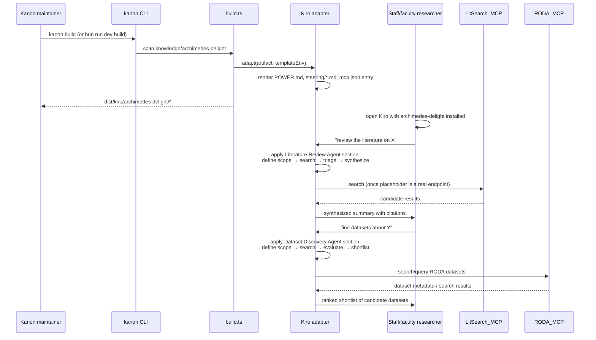

# Design Document

## Overview

Archimedes Delight is a **single** knowledge artifact, `kanon/knowledge/archimedes-delight/` (`type: skill` with `harness-config.kiro.format: power` — see the type/format note below), bundling four capability kinds: data-access MCP servers (RODA, plus a placeholder for literature search), guided research skills (citation management, dataset-discovery guidance), human-followed research workflows (dataset-to-citation pipeline), and two autonomous research agents (literature review, dataset discovery). It follows the same shape as `alice-whiterabbit` and `kanon`, the two existing `jh-drcc` artifacts that already combine steering content with MCP servers and workflows.

An earlier iteration of this design split the literature-review agent into its own `type: agent` artifact with a `depends: [archimedes-delight]` link. That was reconsidered: per **ADR-0014**, `type` is a single asset-taxonomy tag used for discovery, validation, and collection curation — it is explicitly decoupled from output format (ADR-0012/0013), which lives entirely in `harness-config.<harness>.format`. There is no distinct "agent runtime" that `type: agent` unlocks in this pipeline. Concretely, Kiro's format registry (`src/format-registry.ts`) defines only `steering` and `power` as valid Kiro formats — there is no Kiro `agent` format — so a `type: agent` artifact on Kiro renders through the exact same `power`/`steering` template path as this artifact already uses. On Claude Code, both `power` and `agent` render as a CLAUDE.md section regardless. The only harnesses where `agent` produces genuinely different output are Copilot (`AGENTS.md`) and Q Developer (`.q/agents/`), neither of which this artifact targets. Since "agent" behavior here is just documented body content (a loop description) plus MCP access — exactly what `power` already bundles — splitting it out would buy only a distinct catalog tag, at the cost of a second artifact, a second `jh-drcc` collection member, and `depends`-composition wiring that serves no other purpose. Both agents therefore live inside the power and read its MCP servers directly, with no `depends` field needed at all.

### A note on `type` versus the Kiro `power` format

This artifact is authored as `type: skill` with `harness-config.kiro.format: power`, **not** `type: power`. Per **ADR-0051** (Deprecate `power` as an asset-taxonomy value), `power` is Kiro's own output-*format* concept — chosen via `harness-config.kiro.format` — not an asset-*taxonomy* value. `type: power` survives only as a backward-compat alias for `type: skill` and is flagged by `kanon validate` (`type-power-deprecated`); the canonical form going forward is `type: skill` plus an explicit Kiro format. This is fully consistent with ADR-0014's separation of taxonomy from output format — the same reasoning that keeps the two agents inside this artifact rather than splitting them into a `type: agent` artifact. Everywhere this document refers to "the power," it means the Kiro *power output* this artifact produces (`POWER.md` + progressively-disclosed `steering/*.md`), which comes from `harness-config.kiro.format: power`, not from the `type` field. Progressive disclosure is made explicit via `harness-config.kiro.inclusion: manual`, so the artifact ships no always-on steering surface beyond `POWER.md` itself.

Capability-to-primitive mapping, all within this one artifact:

- **MCP data access** → `mcp-servers.yaml` (RODA server, real and working; a Literature_Search_MCP_Server placeholder — see below).
- **Skills** (citation management, dataset-discovery guidance) → `knowledge.md` body sections, each documented as a `manual`-inclusion steering topic (mirroring how `alice-whiterabbit` exposes `model-selection`, `research-prompts`, etc. via `#topic` triggers).
- **Workflows** (human-followed) → `workflows/*.md`, one per Research_Workflow, loaded automatically by `loadKnowledgeArtifact()` and surfaced through Kiro's per-workflow steering files (`fileMatch`/`manual` inclusion, same pattern as `alice-whiterabbit/workflows/*.md`). Literature review and autonomous dataset discovery are explicitly excluded here (Requirement 5.5).
- **Agents** (autonomous) → dedicated `knowledge.md` body sections, clearly delimited from the Skills/Workflows sections, describing each agent's loop, inputs, and outputs. Rendered through the same `power`/steering template path as everything else in the artifact — no separate build path.

No changes to `build.ts`, `parser.ts`, `schemas.ts`, or any adapter are needed. This is pure content authored within existing pipeline capabilities.

## Architecture

```mermaid
graph TD
    subgraph "kanon/knowledge/archimedes-delight/ (type: skill, kiro format: power)"
        KM[knowledge.md<br/>frontmatter + body:<br/>overview, skills, agents, steering table]
        MCP[mcp-servers.yaml<br/>awslabs.roda-mcp-server +<br/>literature-search placeholder]
        WF1[workflows/dataset-discovery.md]
        WF2[workflows/citation-pipeline.md]
    end

    KM -->|loadKnowledgeArtifact| PARSE[parser.ts]
    MCP -->|merged MCP servers| PARSE
    WF1 --> PARSE
    WF2 --> PARSE

    PARSE --> BUILD[build.ts]
    BUILD --> KIRO[adapters/kiro.ts<br/>POWER.md + steering/*.md + mcp.json]
    BUILD --> CC[adapters/claude-code.ts<br/>CLAUDE.md section, partial]

    PARSE --> CATALOG[catalog.ts → catalog.json<br/>one CatalogEntry]
    KM -->|collections: [jh-drcc]| COLLMEM[buildCollectionMembership]
```

### Request/build-time flow for a researcher



## Components and Interfaces

### Directory layout (new files only)

```
kanon/knowledge/archimedes-delight/
├── knowledge.md              # frontmatter + overview + skills + agents + steering table
├── mcp-servers.yaml          # awslabs.roda-mcp-server + literature-search placeholder
└── workflows/
    └── citation-pipeline.md  # dataset/paper → formatted citation
```

`dataset-discovery` is not a `workflows/*.md` file in this revision — dataset discovery is documented as an autonomous agent section (see below), not a human-followed workflow, so only `citation-pipeline.md` remains as a Research_Workflow. No `hooks.yaml` is needed (no automation triggers required for v1); no `evals/` initially — can be added later without design changes.

### `knowledge.md` frontmatter (concrete values)

```yaml
name: archimedes-delight
displayName: Archimedes Delight
description: >-
  Elite academic research library tool for Johns Hopkins staff and faculty.
  Provides MCP-backed data access to research repositories (starting with
  RODA — Registry of Open Data on AWS), guided research skills for citation
  management, autonomous agents for literature review and dataset
  discovery, and multi-step research workflows.
keywords:
  - archimedes-delight
  - jh-drcc
  - roda
  - research-library
  - literature-review
  - dataset-discovery
  - citation-management
  - academic-research
author: Johns Hopkins DRCC
version: 0.1.0
harnesses:
  - kiro
  - claude-code
type: skill
inclusion: auto
categories:
  - documentation
  - devops
ecosystem:
  - aws
depends: []
enhances: []
maturity: experimental
trust: community
audience: advanced
model-assumptions: []
collections:
  - jh-drcc
inherit-hooks: false
harness-config:
  kiro:
    format: power
    inclusion: manual
  claude-code:
    format: claude-md
```

Design decisions on specific fields, tied to requirements:

- `type: skill` + `harness-config.kiro.format: power` (Requirement 1.2) — the artifact is taxonomically a `skill` that renders to Kiro's `power` *format*. This is the canonical pairing per ADR-0051 (see the type/format note in the Overview); `type: power` is a deprecated alias and is not used. The Kiro `power` format is chosen over `reference-pack` because it is designed for exactly this "broad capability bundle with an entry-point doc + steering topics" shape, matching `alice-whiterabbit`'s and `kanon`'s own precedent. `reference-pack` is for manual-inclusion-only reference material and has no natural home for MCP servers or workflow steering. `type: agent` was considered and rejected too — see Overview — since it's a single-artifact taxonomy tag, not a container, and the Kiro power format already accommodates agent-loop content as body sections.
- `harness-config.kiro.inclusion: manual` — makes the Progressive Steering choice explicit (Requirement 6): `POWER.md` is the always-on surface and the workflow/steering files are disclosed on demand, avoiding the `kanon validate` warnings that fire when a power-format artifact leaves inclusion unset or `always`.
- `depends: []` — no dependency composition is used; both agents read MCP servers declared directly in this artifact's own `mcp-servers.yaml`.
- `maturity: experimental` and `audience: advanced` — this is a new, unreleased artifact (Requirement 1) aimed at expert researchers, not a stable general-audience tool; distinguishes it from `alice-whiterabbit` (`stable`) and `jhu-editorial-check`.
- `trust: community` — matches every other `jh-drcc` artifact's trust lane; nothing here claims official JHU endorsement.
- `harnesses: [kiro, claude-code]` (Requirement 6.1) — Kiro gets full power support; Claude Code gets partial (rendered as a CLAUDE.md section) per `compatibility.ts`. No other harness is targeted in v1, so no partial/none surprises there — `kanon build --strict` only evaluates the harnesses actually listed.

### `mcp-servers.yaml` (concrete content)

Translating the user-supplied native MCP JSON into this repo's list shape (Requirement 3.1), plus a second entry for the literature-search placeholder (Requirement 7). This file's schema is a discriminated union (`src/schemas.ts`'s `StdioMcpServerSchema` / `UrlMcpServerSchema`, selected by presence of `command` vs. `url` — see `knowledge/kiro-official/stripe/mcp-servers.yaml` for a real precedent of the URL-based shape):

```yaml
- name: awslabs.roda-mcp-server
  description: >-
    AWS Labs RODA (Registry of Open Data on AWS) MCP server. Provides
    search, metadata retrieval, and discovery over datasets published in
    the Registry of Open Data on AWS.
  command: uvx
  args:
    - awslabs.roda-mcp-server@latest
  env:
    FASTMCP_LOG_LEVEL: ERROR
  autoApprove: []

- name: archimedes-delight-literature-search
  transport: sse
  url: https://TBD.internal.jh.edu/mcp
  description: >-
    PLACEHOLDER — literature-search MCP server (PubMed / arXiv / Semantic
    Scholar). No official institutional remote MCP endpoint exists for any
    of these sources as of this writing; this entry is a placeholder
    pending a JHU DRCC-hosted instance. A documented starting point for
    that instance is cyanheads/pubmed-mcp-server (supports self-hosting
    via transport: http or sse). Do not point this at an unaffiliated
    third party's personally-hosted instance in production.
  autoApprove: []
```

`autoApprove: []` on RODA is the deliberate default from Requirement 3.3 — the actual `awslabs.roda-mcp-server` tool list isn't enumerated at authoring time (open question carried from requirements), so nothing is pre-approved until a maintainer inspects the package's tools and opts specific read-only ones in. This mirrors `bedrock-agentcore-mcp-server`'s entry in `alice-whiterabbit/mcp-servers.yaml`, which also ships `autoApprove: []` for the same reason. The literature-search placeholder ships `autoApprove: []` for the same conservative reason, doubly so since its `url` isn't even real yet.

No `disabled` field is set on either entry (Requirement 7.5) — a placeholder `url` is a functional gap to resolve later, not a reason to mark the server disabled; `disabled` is a separate decision left for whoever wires up the real endpoint.

No `${ENV_VAR}` credential placeholders are needed for RODA specifically (Requirement 3.4) — RODA is a public AWS Registry of Open Data service with no auth in its documented MCP config. The requirement's `${ENV_VAR}` guidance remains documented in `knowledge.md`'s body as guidance for *future* data-access servers added to this file that do need credentials (e.g. a JHU-internal repository API, or the eventual real literature-search endpoint if it requires auth), satisfying 3.4 without inventing unused config now.

### `knowledge.md` body structure

```markdown
# Archimedes Delight

## Overview
<what it is, who it's for; note that literature review and dataset
discovery are autonomous agents (below), distinct from the guided
skills and workflows>

## Data Access

### RODA MCP Server
<what awslabs.roda-mcp-server exposes: search, metadata, discovery over
Registry of Open Data on AWS; note that tool list should be confirmed
against the installed package version before enabling autoApprove entries>

### Literature Search MCP Server (placeholder)
<state plainly: no official institutional remote MCP server exists today
for PubMed, arXiv, or Semantic Scholar (confirmed during this spec's
authoring); this entry's url is a placeholder pending a JHU DRCC-hosted
instance; cyanheads/pubmed-mcp-server is a documented candidate
implementation for that future instance, self-hostable via transport:
http/sse; do not substitute an unaffiliated third party's personally-
hosted instance>

## Available Steering Files
| File | Inclusion | Trigger | Content |
|---|---|---|---|
| **citation-pipeline** | manual | `#citation-pipeline` | Turning a discovered dataset/paper into a formatted citation |

## Research Skills
### Citation Management
<inputs, outputs, dependency on citation-pipeline workflow>

## Autonomous Research Agents
<clearly delimited from Research Skills above — these run their own
loop rather than being guided step-by-step>

### Literature Review Agent
- **Inputs:** a research question or topic (free text)
- **Outputs:** a synthesized literature summary with citations
- **Loop:** define scope → search via Literature Search MCP Server →
  triage/screen results → synthesize findings
- **Current limitation:** the Literature Search MCP Server is currently a
  placeholder (see Data Access above); until a real endpoint is wired up,
  this agent should tell the user the search step cannot be completed
  rather than silently failing or fabricating results

### Dataset Discovery Agent
- **Inputs:** a research question or dataset criteria (free text)
- **Outputs:** a ranked shortlist of candidate datasets
- **Loop:** define scope → search via RODA MCP Server → evaluate
  candidate datasets (relevance, size, license, format) → shortlist
- **Current limitation:** RODA's exact tool list is unconfirmed at
  authoring time (see Data Access above); the agent should rely only on
  documented/confirmed RODA tools once `autoApprove` is populated, and
  otherwise proceed as normal since the RODA endpoint itself is real and
  working
```

This satisfies Requirement 4.3 (document purpose/inputs/outputs per skill), Requirement 8.2/8.3 (document each agent's loop, inputs, and outputs), and Requirement 8.5 (agents visually and structurally distinguished from skills/workflows). Since `type` is `power`, `generate-plugin-skills.ts`'s selector (`type === "skill" || type === "power"`) already includes this artifact, so it still renders as a single combined Claude Code plugin skill (`skills/archimedes-delight/SKILL.md`) covering the skill, the workflow, and both agent sections — no per-capability sub-artifact is needed to appear in the plugin skill library.

### Workflow file (Requirement 5)

The one remaining `workflows/*.md` file follows the shared structure `loadKnowledgeArtifact()` expects (filename + trimmed content, no per-file frontmatter):

```markdown
# Citation Pipeline

## Trigger
<when this workflow applies — e.g. "user has a dataset or paper reference and needs a formatted citation">

## Depends On
- MCP servers: none (works from a dataset/paper reference already in hand,
  or from the Dataset Discovery Agent's output)
- Skills: Citation Management

## Steps
1. Extract metadata from the dataset/paper reference
2. Select citation style
3. Format
4. Verify
```

Single-procedure (Requirement 5.4). Literature review and dataset discovery are intentionally not workflow files (Requirement 5.5) — both are documented as Autonomous Research Agents in `knowledge.md` instead, since they run their own loop rather than steps a human executes.

## Data Models

No new Zod schemas or `KNOWN_FRONTMATTER_FIELDS` entries are introduced. All frontmatter fields used above already exist in `FrontmatterSchema`. `mcp-servers.yaml` uses the existing discriminated-union shape (`StdioMcpServerSchema` for RODA, `UrlMcpServerSchema` for the literature-search placeholder) already consumed by `build.ts`'s MCP-merge step. No `depends` composition is used — `resolveComposition()` in `build.ts` is not exercised by this artifact.

## Error Handling

| Failure mode | Handling |
|---|---|
| `kanon validate --security` flags an env var in `mcp-servers.yaml` | N/A for `FASTMCP_LOG_LEVEL` (not credential-shaped); documented pattern (`${ENV_VAR}`) given in body for any future credentialed server, satisfying Requirement 3.4 before it's ever needed |
| `kanon build --strict` run for a harness not in `harnesses:` | Not applicable — `harnesses: [kiro, claude-code]` are `full`/`partial`-defined for `power` in `compatibility.ts`; no undeclared harness is targeted (Requirement 6.2/6.3) |
| `loadKnowledgeArtifact()` encounters a malformed workflow file | Existing parser behavior (warnings array) surfaces via `kanon validate`; addressed by keeping the workflow file to plain markdown with no custom frontmatter, matching every existing workflow file in the repo |
| A future maintainer adds a second data-access MCP server incorrectly (e.g. wrong list nesting) | `mcp-servers.yaml` stays a flat top-level YAML list (Requirement 3.5) — appending a new `- name: ...` entry requires no restructuring, same as `alice-whiterabbit`'s two-entry file |
| Collection membership drift | Not applicable — membership is derived at build time from `collections: [jh-drcc]` alone (Requirement 2), no manifest edit, no separate failure path |
| Literature-search placeholder `url` is left unresolved indefinitely | Not a build error (Requirement 7.4) — `kanon build` succeeds; the functional gap is surfaced only in documentation (the Data Access section) and in the Literature Review Agent's "Current limitation" note, which instructs the agent to tell the user rather than fail silently or fabricate results |
| A reader confuses an Autonomous Research Agent section for a guided Research Skill | Mitigated structurally, not just by naming — the body groups agents under their own `## Autonomous Research Agents` heading, separate from `## Research Skills`, per Requirement 8.5 |

## Testing Strategy

This is a content-only, single-artifact addition; the existing test suite already exercises the pipeline generically, so testing here means **validating the artifact against that pipeline**, not adding new unit tests to `kanon`'s own `src/__tests__/`.

- **`bun run dev catalog generate`** (or `kanon catalog generate`) — confirms `archimedes-delight` appears as a valid `CatalogEntry` in `catalog.json` (Requirement 1.6).
- **`bun run dev validate`** — confirms no schema errors across `knowledge.md`, `mcp-servers.yaml`, and `workflows/citation-pipeline.md` (Requirement 6.4).
- **`bun run dev validate --security`** — confirms no credential-like hardcoded value is flagged in `mcp-servers.yaml`, and that the literature-search placeholder's non-real `url` doesn't itself trigger a security warning (Requirement 3.6).
- **`bun run dev build`** (default, non-strict) and **`bun run dev build --strict`** — confirms Kiro output (`POWER.md`, `steering/citation-pipeline.md`, MCP config entry with both servers) and Claude Code output (CLAUDE.md section, including both agent sub-sections) render without strict-mode errors (Requirement 6.2/6.3).
- **Manual collection check** — after build, inspect that `buildCollectionMembership()`'s output (or the browse UI / MCP bridge `collection_list` tool) lists `archimedes-delight` under `jh-drcc` (Requirement 2.3).
- **`bun run build:skills`** — confirms `archimedes-delight` is selected (via `type: skill` + `claude-code` harness) and a `skills/archimedes-delight/SKILL.md` is generated and committed, containing both agent sections and the citation skill/workflow, exercising the plugin-skill path noted in Components above.

No property-based tests are warranted — this artifact introduces no executable logic, only declarative content consumed by an already-tested compiler.

## Decisions and Trade-offs

1. **One artifact, not two (or three).** Reconsidered from an earlier draft that split literature review into its own `type: agent` artifact. Per ADR-0014, `type` is a single taxonomy tag decoupled from output format; Kiro has no distinct `agent` format (only `steering`/`power`), so splitting bought only a catalog-filter tag at the cost of a second artifact, collection member, and unused `depends` wiring. Folding agents into the power keeps one catalog entry, one collection membership, one version, and zero cross-artifact composition — the right trade for two agents that are functionally just documented loops over MCP servers this artifact already owns.
2. **`type: skill` + `harness-config.kiro.format: power`, not `type: power`, `reference-pack`, or `agent`.** Per ADR-0051, `power` is an output-format concept, not a taxonomy value; `type: power` is a deprecated alias that `kanon validate` flags. So the artifact is a `skill` taxonomically and selects the Kiro `power` format explicitly. The power *format* gives a proper Kiro entry point (`POWER.md`) and matches the "one bundle, several capabilities" shape of the two other multi-capability `jh-drcc` artifacts, and accommodates agent-loop content as body sections — none of which requires the deprecated `type: power` or a `reference-pack`/`agent` taxonomy tag.
3. **Inline research skills and agents instead of namespaced sub-artifacts.** Keeps one artifact = one catalog entry = one collection membership, and still produces a single combined Claude Code plugin skill via the `generate-plugin-skills.ts` selector (`type === "skill" || type === "power"`), which selects this artifact on its `type: skill` — no schema or script change needed.
4. **`autoApprove: []` for RODA and the literature-search placeholder.** Safer default for RODA pending tool-list confirmation; doubly appropriate for the placeholder since its endpoint isn't even real yet. Deferred rather than guessed.
5. **Literature-search MCP server is a documented placeholder, not a working third-party-hosted URL.** The only real remote instance found during research (`cyanheads/pubmed-mcp-server`'s community-hosted `https://pubmed.caseyjhand.com/mcp`) is an unaffiliated individual's personal hosting with no SLA — unsuitable as the backbone of an "elite academic research library tool." Trade-off: literature review has no working search capability until JHU DRCC stands up its own instance; the agent's documented "Current limitation" behavior (tell the user, don't fabricate) is the mitigation until then. Dataset discovery has no equivalent gap — RODA is real and working.
6. **No `${ENV_VAR}` credentials wired up for RODA.** RODA's public/no-auth MCP config, as given, needs none; the credential-boundary guidance from `CLAUDE.md` is documented for future data-access servers instead of applied to a server that doesn't need it, avoiding speculative config.
7. **No changes to `build.ts`/`parser.ts`/`schemas.ts`/adapters.** Every capability needed (MCP servers, steering topics, workflows, URL-based MCP servers) already has a home in the existing pipeline; extending the pipeline, or exercising the `depends`-composition path, would be unjustified scope for a content-only artifact that doesn't need it.
