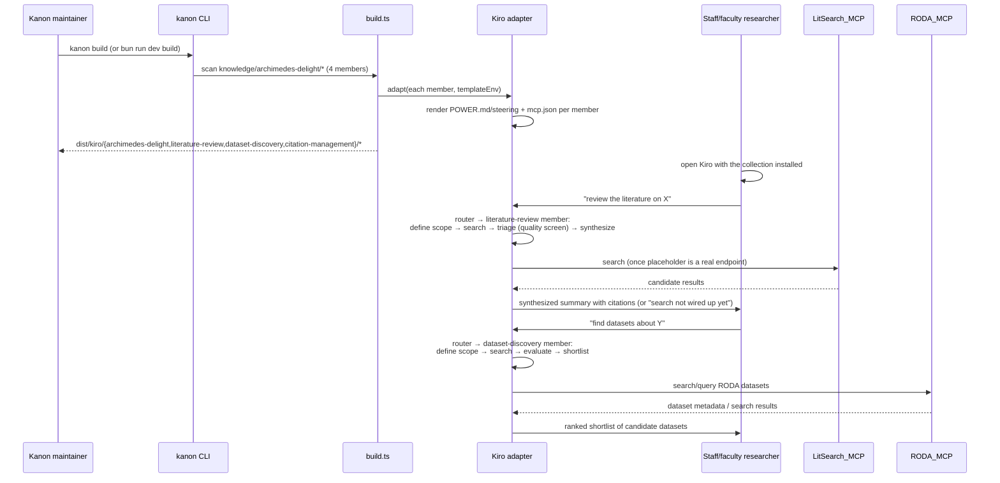

# Design Document

## Overview

Archimedes Delight is a **collection** of knowledge artifacts under a shared namespace directory, `kanon/knowledge/archimedes-delight/`, with a **router** artifact (also named `archimedes-delight`) that directs the user to the right member. It follows the `byron-powers` precedent: a namespaced container directory holding one member directory per artifact, each declaring `collections: [archimedes-delight]` in its own frontmatter, plus a metadata-only collection manifest at `collections/archimedes-delight.yaml` (ADR-0016).

The collection has ten members — a router plus nine capabilities, grouped by research phase (discover → appraise → create → communicate):

- **`archimedes-delight`** (router; `type: skill`, Kiro format `power`) — the entry point. Describes the collection and routes intent to the correct member. Declares `depends: [<all nine capability members>]`.

Discover:
- **`literature-review`** (`type: agent`) — autonomous literature review over the Literature_Search_MCP_Server (the bundled `bibliographic-mcp` server).
- **`dataset-discovery`** (`type: agent`) — autonomous dataset discovery over the RODA_MCP_Server.
- **`research-ideation`** (`type: skill`) — divergent-thinking methods + hypothesis formulation.

Appraise:
- **`critical-appraisal`** (`type: skill`) — evaluate evidence (design hierarchy, effect sizes, bias, GRADE).
- **`peer-review`** (`type: skill`) — structured seven-stage manuscript/proposal review.

Create:
- **`manuscript-writing`** (`type: skill`) — IMRAD, reporting guidelines, venue adaptation.
- **`citation-management`** (`type: skill`) — guided citation formatting, with a `citation-pipeline` workflow.
- **`figure-preparation`** (`type: skill`) — figure QA, journal requirements, schematics.

Communicate:
- **`research-presentation`** (`type: skill`) — slides and posters.

The four capability members drawn from the sibling `SciAgent-Skills` project's `scientific-writing` set (`research-ideation`, `critical-appraisal`, `peer-review`, `manuscript-writing`, `figure-preparation`, `research-presentation`) are **adaptations of CC-BY-4.0 source**, condensed and made domain-neutral (no life-sciences-specific content), each carrying an `attribution` block crediting SciAgent-Skills with `relationship: adapted`. Overlapping SciAgent skills (`citation-management`, `literature-review`) were folded into the existing same-named members rather than duplicated, and its database-client skills (PubMed/OpenAlex/bioRxiv) were excluded in favor of the `bibliographic-mcp` data-access path.

**Why a collection, not one artifact.** An earlier iteration of this design folded all four capabilities into a *single* `type: power` artifact with body sections, reasoning (per **ADR-0014**) that `type` is a taxonomy tag decoupled from output format and that Kiro has no distinct `agent` format, so splitting bought only a catalog tag. That reasoning still holds for *output format*, but a collection was chosen for a different reason: **discoverability and independent installation**. As separate members, each capability is its own `CatalogEntry`, can be installed on its own, renders as its own Claude Code plugin skill, and carries its own `type` (`agent` vs `skill`) so a harness that *does* distinguish agents (Copilot `AGENTS.md`, Q Developer) gets the right shape. The router artifact preserves the "one front door" experience the single-artifact design gave, without collapsing the members into one entry.

Concretely, the namespace layout is required by the pipeline's one-level discovery rule (`collectArtifactPaths` in `build.ts`/`validate.ts`/`catalog.ts`): a directory that contains a `knowledge.md` **is** a single artifact and is not descended into. So `knowledge/archimedes-delight/` must be a **pure container** (no root `knowledge.md`); the router lives at `knowledge/archimedes-delight/archimedes-delight/knowledge.md` alongside the three capability members. This mirrors `byron-powers/` exactly.

Capability-to-primitive mapping, one member per capability:

- **MCP data access** → each agent member's own `mcp-servers.yaml` (RODA under `dataset-discovery`; the Literature_Search_MCP_Server placeholder under `literature-review`).
- **Guided skill** (citation management) → `citation-management/knowledge.md` body + `citation-management/workflows/citation-pipeline.md`.
- **Autonomous agents** (literature review, dataset discovery) → their own member `knowledge.md`, each `type: agent`, documenting a goal, inputs, outputs, and an explicit autonomous loop.
- **Routing** → `archimedes-delight/knowledge.md`, which maps user intent to the correct member.

**Positioning — human-in-the-loop.** Archimedes Delight targets JHU staff and faculty engaged in advanced research, so the agent members adopt an explicit human-in-the-loop boundary (following the ARS `deep-research` stance, "AI is your copilot, not the pilot"): **the agent triages and synthesizes; the researcher judges and verifies.** Neither agent asserts a question is settled, and neither fabricates a source, result, or metadata value to fill a gap — a missing answer is reported as a gap.

The member content is authored within existing pipeline capabilities (the namespaced-collection layout is already supported) — no changes to `build.ts`, `parser.ts`, `schemas.ts`, or any adapter. The **registry.yaml generation** is the one code addition: a pure projection module `src/registry.ts` (catalog entry → SciAgent-style registry entry) plus a thin CLI `scripts/generate-registry.ts`, with `catalogCommand` in `catalog.ts` writing a bazaar-wide `registry.yaml` alongside `catalog.json`. See "Registry generation" below and the Decisions section.

## Architecture

```mermaid
graph TD
    subgraph "kanon/knowledge/archimedes-delight/ (pure container)"
        ROUTER[archimedes-delight/knowledge.md<br/>type: skill · router<br/>members table + routing tree]
        LR[literature-review/<br/>type: agent · knowledge.md<br/>+ mcp-servers.yaml: lit-search placeholder]
        DD[dataset-discovery/<br/>type: agent · knowledge.md<br/>+ mcp-servers.yaml: RODA]
        CM[citation-management/<br/>type: skill · knowledge.md<br/>+ workflows/citation-pipeline.md]
    end

    ROUTER -->|depends: 3 members| LR
    ROUTER --> DD
    ROUTER --> CM

    LR -->|loadKnowledgeArtifact| PARSE[parser.ts]
    DD --> PARSE
    CM --> PARSE
    ROUTER --> PARSE

    PARSE --> BUILD[build.ts]
    BUILD --> KIRO[adapters/kiro.ts<br/>POWER.md + steering/*.md + mcp.json]
    BUILD --> CC[adapters/claude-code.ts<br/>CLAUDE.md section]

    PARSE --> CATALOG[catalog.ts → catalog.json<br/>4 CatalogEntry records]
    ROUTER -->|collections: [archimedes-delight]| COLLMEM[buildCollectionMembership]
    LR --> COLLMEM
    DD --> COLLMEM
    CM --> COLLMEM
```

### Request/build-time flow for a researcher



## Components and Interfaces

### Directory layout (new files only)

```
kanon/collections/archimedes-delight.yaml        # metadata-only collection manifest (ADR-0016)
kanon/knowledge/archimedes-delight/              # PURE CONTAINER — no root knowledge.md
├── registry.yaml                                # generated collection index (SciAgent-style)
├── archimedes-delight/                          # router member
│   ├── knowledge.md                             # overview + members table + routing tree
│   └── hooks.yaml                               # [] (no automation for v1)
├── literature-review/                           # autonomous agent member (discover)
│   ├── knowledge.md                             # goal, inputs, outputs, loop, failure modes
│   └── mcp-servers.yaml                         # bibliographic-mcp (bundled server)
├── dataset-discovery/                           # autonomous agent member (discover)
│   ├── knowledge.md                             # goal, inputs, outputs, loop, failure modes
│   └── mcp-servers.yaml                         # awslabs.roda-mcp-server (stdio)
├── research-ideation/knowledge.md               # guided skill (discover) — CC-BY adapted
├── critical-appraisal/knowledge.md              # guided skill (appraise) — CC-BY adapted
├── peer-review/knowledge.md                     # guided skill (appraise) — CC-BY adapted
├── manuscript-writing/knowledge.md              # guided skill (create) — CC-BY adapted
├── figure-preparation/knowledge.md              # guided skill (create) — CC-BY adapted
├── research-presentation/knowledge.md           # guided skill (communicate) — CC-BY adapted
└── citation-management/                         # guided skill member (create)
    ├── knowledge.md                             # guide: concepts, decision framework, pitfalls
    └── workflows/
        └── citation-pipeline.md                 # dataset/paper → formatted citation
```

Dataset discovery and literature review are **agent members** (`type: agent`), not `workflows/*.md` files — they run their own loop rather than being human-followed steps (Requirement 5.5). Only `citation-pipeline.md` is a Research_Workflow, and it lives under the `citation-management` member. RODA's `mcp-servers.yaml` lives with `dataset-discovery`; the literature-search entry lives with `literature-review`; each stays a flat top-level YAML list so more data-access servers can be appended without restructuring (Requirement 3.5). The six SciAgent-adapted guided skills each carry an `attribution` block (CC-BY-4.0, `relationship: adapted`). `registry.yaml` is generated (see Registry generation below), not hand-authored. No `evals/` initially — can be added per-member later.

### Registry generation

Kanon's authoritative machine index is `catalog.json`; `registry.yaml` is a lighter, human-readable, SciAgent-Skills-compatible index (one entry per artifact: `name`, `type`, `sub_type`, `category`, `path`, `description`, `date_added`, `tags?`). It is **generated**, never hand-edited, from the same parsed catalog so the two never drift. Two scopes:

- **Bazaar-wide** — every catalog artifact → a top-level `kanon/registry.yaml`. Bundled with catalog creation: `catalogCommand` in `src/catalog.ts` writes it alongside `catalog.json` on every `kanon catalog generate`.
- **Collection-scoped** — only members of one collection → that collection's own `registry.yaml` (e.g. `kanon/knowledge/archimedes-delight/registry.yaml`), for a substantial collection that warrants its own index. Produced by `bun run scripts/generate-registry.ts --collection archimedes-delight` (also `bun run build:registry`).

The pure projection lives in `src/registry.ts` (`toRegistryEntry`, `renderBazaarRegistry`, `renderCollectionRegistry`), shared by both paths. Kanon has no `sub_type` field, so it is **inferred** from artifact shape: `type: agent` → `agent`; has MCP servers → `database`; has workflows → `pipeline`; otherwise → `guide`. `category` is the artifact's first `categories` entry; remaining categories plus `ecosystem` become `tags`.

### Router `knowledge.md` frontmatter (concrete values)

```yaml
name: archimedes-delight
displayName: Archimedes Delight
version: 0.2.0
description: >-
  Router for the Archimedes Delight research-science collection. Directs JHU
  staff and faculty across the research arc — discover, appraise, create,
  communicate — to the right member.
keywords:
  - archimedes-delight
  - research
  - academia
  - literature-review
  - dataset-discovery
  - citation-management
  - manuscript-writing
  - router
author: Steven J. Miklovic
type: skill
inclusion: manual
categories:
  - writing
harnesses:
  - kiro
  - claude-code
  - codex
  - copilot
  - cursor
  - gemini-cli
ecosystem:
  - science
depends:
  - literature-review
  - dataset-discovery
  - citation-management
  - critical-appraisal
  - research-ideation
  - manuscript-writing
  - peer-review
  - figure-preparation
  - research-presentation
enhances: []
maturity: experimental
model-assumptions: []
collections:
  - archimedes-delight
inherit-hooks: false
harness-config:
  kiro:
    format: power
    inclusion: manual
  codex:
    format: skill
```

Each capability member uses the same author/collection/harness set, with `type: agent` for `literature-review` and `dataset-discovery` and `type: skill` for the seven guided skills (`research-ideation`, `critical-appraisal`, `peer-review`, `manuscript-writing`, `figure-preparation`, `research-presentation`, `citation-management`). The six SciAgent-adapted guided skills additionally carry an `attribution` block (`upstream[].{work, authors, license: CC-BY-4.0, url, relationship: adapted}` plus a `notice`). Codex's format is `skill` for all members (codex only supports `agents-md` and `skill`; `agent` is not a valid codex format).

Design decisions on specific fields, tied to requirements:

- `type: skill` on the router (Requirement 1.2) — canonical per ADR-0051, with `harness-config.kiro.format: power` giving Kiro a proper power entry point. (`type: power` is a deprecated alias that raises a validation warning; the router uses `skill` to stay clean.) `type: agent` on the two agent members is what lets a harness that distinguishes agents render them correctly.
- `depends: [<all nine capability members>]` on the router — declares the collection's shape and resolves cleanly because every name is discovered as a sibling member. The capability members themselves use `depends: []`; each is self-contained (agents read only the MCP servers in their own `mcp-servers.yaml`), so no cross-member composition is exercised.
- `collections: [archimedes-delight]` on every member — membership is derived at build time from this field alone (ADR-0016); removing a member directory drops it from the collection with no manifest edit.
- `maturity: experimental` — new, unreleased artifacts aimed at expert researchers.
- `harnesses: [kiro, claude-code, codex, copilot, cursor, gemini-cli]` (Requirement 6.1) — Kiro gets full power support; other harnesses render with expected capability-degradation warnings (e.g. `toggleable-rules` omitted, `workflows` inlined) rather than errors. `kanon build --strict` only evaluates the harnesses actually listed.

### `mcp-servers.yaml` (concrete content)

Translating the user-supplied native MCP JSON into this repo's list shape (Requirement 3.1), plus a second entry for the literature-search placeholder (Requirement 7). This file's schema is a discriminated union (`src/schemas.ts`'s `StdioMcpServerSchema` / `UrlMcpServerSchema`, selected by presence of `command` vs. `url` — see `knowledge/kiro-official/stripe/mcp-servers.yaml` for a real precedent of the URL-based shape):

```yaml
- name: awslabs.roda-mcp-server
  description: >-
    AWS Labs RODA (Registry of Open Data on AWS) MCP server. Provides
    search, metadata retrieval, and discovery over datasets published in
    the Registry of Open Data on AWS.
  command: uvx
  args:
    - awslabs.roda-mcp-server@latest
  env:
    FASTMCP_LOG_LEVEL: ERROR
  autoApprove: []

- name: archimedes-delight-literature-search
  transport: sse
  url: https://TBD.internal.jh.edu/mcp
  description: >-
    PLACEHOLDER — literature-search MCP server (PubMed / arXiv / Semantic
    Scholar). No official institutional remote MCP endpoint exists for any
    of these sources as of this writing; this entry is a placeholder
    pending a JHU DRCC-hosted instance. A documented starting point for
    that instance is cyanheads/pubmed-mcp-server (supports self-hosting
    via transport: http or sse). Do not point this at an unaffiliated
    third party's personally-hosted instance in production.
  autoApprove: []
```

No `disabled` field is set on either entry (Requirement 7.5) — a placeholder `url` is a functional gap to resolve later, not a reason to mark the server disabled; `disabled` is a separate decision left for whoever wires up the real endpoint.

No `${ENV_VAR}` credential placeholders are needed for RODA specifically (Requirement 3.4) — RODA is a public AWS Registry of Open Data service with no auth in its documented MCP config. The `${ENV_VAR}` guidance is documented in the member body as guidance for *future* credentialed data-access servers (e.g. a JHU-internal repository API, or a real literature-search endpoint if it requires auth), satisfying 3.4 without inventing unused config now.

#### RODA Data Access section (Requirement 3.2, written in SciAgent database-skill shape)

The `dataset-discovery` member documents RODA the way SciAgent-Skills documents a `database` sub-type skill — task-perspective "when to use" bullets, then enumerated operations, then a routing pointer — rather than a one-line "search, metadata, discovery" gloss. The `## Data Access` section reads:

- **When to use RODA** (bullets from the researcher's task, e.g. "you need an openly-licensed dataset to work with", "you want to discover what public datasets exist for a domain", "you have a dataset name and need its metadata/location") — and one negative bullet routing papers away: "for *papers and evidence*, use the `literature-review` member instead."
- **Operations** — enumerated to the extent discoverable from the installed `awslabs.roda-mcp-server` package: search datasets, retrieve dataset metadata, discover/browse the registry. The section notes the tool list must be confirmed against the installed package version before any operation is added to `autoApprove`.
- **RODA-vs-literature routing pointer** — one line stating that RODA serves datasets and the Literature_Search_MCP_Server serves papers, so an agent/user picks the right server for the task (this also lives in the router's routing tree).

#### `autoApprove` policy (Requirement 3.3, Open Question 1)

Both servers ship `autoApprove: []`. The member body documents the **read-only-only rubric** a future maintainer applies when opting tools in, adapted from the read/search/metadata framing SciAgent's database skills use:

- Auto-approve **only** tools that are read-only — search, metadata retrieval, discovery/browse.
- **Never** auto-approve anything that mutates state, incurs non-trivial cost, or has side effects.
- Confirm each candidate tool's behavior against the *installed* package version before adding it (tool lists change across versions).

This answers Open Question 1: the qualifying set is "read-only search/metadata/discovery tools, confirmed against the installed version"; everything else stays behind manual approval. The literature-search placeholder keeps `[]` regardless, since its endpoint isn't real yet.

### Member `knowledge.md` body structures

Each member is authored to its own kind. The agent members follow the ARS
`deep-research` phase shape; the citation member follows SciAgent's prose-guide
template; the router body is a routing map.

#### Router — `archimedes-delight/knowledge.md`

```markdown
# Archimedes Delight

## Overview
<front desk of the research library — a router, not a doer>

## Members
| Member | Kind | Use it when you want to… |
| literature-review | Autonomous agent | "review the literature on X" → cited summary |
| dataset-discovery | Autonomous agent | "find datasets about Y" → ranked shortlist |
| citation-management | Guided skill | turn a reference into a formatted citation |

## Routing
<intent → member decision tree, incl. RODA-vs-literature and
autonomous-vs-guided distinctions, and the human-in-the-loop boundary>

## Getting Started
<ask goal → map to member → confirm mode → hand off; sequence members
for multi-part goals>
```

#### Agent members — ARS phase shape (Requirement 8; answers Open Question 2)

Both `literature-review` and `dataset-discovery` are structured as ARS phases:
a `## Goal`, `## Inputs`, `## Outputs`, and a `## Autonomous Loop` in which **each
step names its own deliverable** (this heading set also satisfies the validator's
`agent-should-document-loop` convention). Each closes with a `## Failure Modes`
table and a human-in-the-loop boundary.

`literature-review` loop (define scope → search → triage → synthesize), each step
carrying a deliverable, e.g.:

```markdown
## Autonomous Loop
1. **Define scope** → a scoped question brief (in/out-of-scope + sub-questions)
2. **Search** → a candidate source list (documented strategy, deduplicated)
3. **Triage** → a screened, quality-graded source set
4. **Synthesize** → the cited summary + gaps + limitations
```

**Source quality in triage (Requirement 8; ARS source-verification concerns).**
The triage step is not just relevance filtering — it folds in the ARS
`source_verification_agent` concerns: grade by **evidence tier** (systematic
reviews/RCTs > single observational studies > preprints/opinion), check
**currency** for fast-moving fields, and run a **predatory-journal / conflict-of-
interest screen**. Off-topic and duplicate results are dropped.

**"Synthesis, not summary" note.** The synthesize step carries a one-line quality
rule (from ARS `synthesis_agent`): *integrate across sources rather than
summarizing them one at a time; surface and explain contradictions instead of
cherry-picking; weight claims by evidence quality.*

`dataset-discovery` loop (define scope → search via RODA → evaluate → shortlist),
evaluate scoring on relevance, size, license, format, and currency/provenance,
each step likewise carrying a deliverable.

**Failure-modes tables.** Each agent documents a small table (answering Open
Question 2 — graceful degradation vs. explicit "not wired up"):

| Member | Key rows |
|---|---|
| literature-review | **Literature-search MCP is still a placeholder** → tell the user search isn't wired up; offer to synthesize user-supplied sources; never fabricate. Too few sources → broaden + report thin evidence. Contradictions → surface + weight, don't cherry-pick. Won't converge → propose narrower sub-questions. Only low-quality sources → say so, don't launder. |
| dataset-discovery | **RODA tool not in confirmed/approved set** → use only documented read-only tools; report the unused capability rather than calling an unapproved tool. No candidates → broaden criteria + report empty. Unclear license → flag as unconfirmed, don't assert fitness. Vague criteria → return to scope. Missing metadata → report unknown, never fabricate. |

**Human-in-the-loop boundary** (positioning). Each agent states plainly that it
triages/synthesizes while the researcher judges/verifies, and that it never
invents a source, result, or metadata value to fill a gap.

#### Citation member — SciAgent prose-guide shape (Requirements 4, 5)

`citation-management/knowledge.md` follows SciAgent's `SKILL_TEMPLATE_PROSE.md`:
`## Overview` → `## Key Concepts` (source type, citation style, metadata
completeness) → `## Decision Framework` (an ASCII decision tree *and* a decision
table: paper-vs-dataset, DOI-vs-accession, venue style vs. field default) →
`## Best Practices` (fix style first, verify metadata before formatting, cite
datasets as first-class, one style per bibliography, confirm with the researcher)
→ `## Common Pitfalls` (5+, each with a "how to avoid" — e.g. formatting before
metadata is complete; citing a dataset as a bare URL; mixing styles; guessing a
missing DOI; ignoring the venue's required style) → `## Workflow` (points at
`citation-pipeline`) → `## Further Reading` → `## Related Skills`.

This satisfies Requirement 4.3 (purpose/inputs/outputs), Requirements 8.2/8.3
(each agent's loop, inputs, outputs), and Requirement 8.5 (agents structurally
distinguished from the guided skill — they're separate members with `type:
agent`). Because each member carries `type: skill`/`agent` + `claude-code`,
`generate-plugin-skills.ts` renders one plugin skill **per member** (four
`skills/<member>/SKILL.md` files), not one combined skill — the collection is the
grouping mechanism, so per-member plugin skills are the intended output.

#### Router persona and voice (Requirement 9)

The router carries a light-touch, erudite **Router persona** with an
Archimedes-of-Syracuse classical framing. This is realized entirely in the
router member's `knowledge.md`, and only in two places:

- **`## Overview`** and **`## Getting Started`** (the hand-off prose) — these
  adopt the persona: an erudite, professional voice pitched for JHU staff and
  faculty, a light signature framing that evokes Archimedes of Syracuse (for
  example a sparing "Eureka" / lever-and-fulcrum nod or a single classical
  flourish), and occasional dry wit. The flourish is used **sparingly** —
  roughly one touch per section, never saturating the prose (Requirement 9.1,
  9.5).
- **Everything else stays factual and neutral.** The `## Members` table, the
  `## Routing` decision tree, and the routing notes keep their existing
  task-focused tone unchanged — the persona never touches routing logic,
  the members table, or any precision-bearing content (Requirement 9.2, 9.3).

Guardrails the persona must not cross (Requirement 9.4):

- It preserves the **human-in-the-loop boundary** — the agents still triage and
  synthesize while the researcher judges and verifies.
- It preserves the **never-fabricate rule** — the router still never invents a
  source, result, or metadata value to fill a gap; a light voice is layered
  on top of, never in place of, that honesty.
- It does not alter **routing accuracy** — intent-to-member mapping is unchanged.

All nine capability members retain their existing neutral, task-focused voice;
the persona is confined to the router (Requirement 9.2). This is a
**content-only** change to the router's `knowledge.md` — no schema, adapter, or
build-pipeline change (Requirement 9.6).

### Workflow file (Requirement 5)

`citation-management/workflows/citation-pipeline.md` follows the shared structure `loadKnowledgeArtifact()` expects (filename + trimmed content, no per-file frontmatter):

```markdown
# Citation Pipeline

## Trigger
<when this workflow applies — e.g. "user has a dataset or paper reference and needs a formatted citation">

## Depends On
- MCP servers: none (works from a dataset/paper reference already in hand,
  or from the dataset-discovery member's output)
- Skills: Citation Management (this member)

## Steps
1. Extract metadata from the dataset/paper reference (mark unknowns as unknown)
2. Select citation style (venue style, else field default)
3. Format
4. Verify (all required fields present + resolvable, else report the gap)
```

Single-procedure (Requirement 5.4). Literature review and dataset discovery are intentionally not workflow files (Requirement 5.5) — both are their own `type: agent` members, since they run their own loop rather than steps a human executes.

## Data Models

No new Zod schemas or `KNOWN_FRONTMATTER_FIELDS` entries are introduced. All frontmatter fields used across the members already exist in `FrontmatterSchema`. Each agent member's `mcp-servers.yaml` uses the existing discriminated-union shape (`StdioMcpServerSchema` for RODA, `UrlMcpServerSchema` for the literature-search placeholder) already consumed by `build.ts`'s MCP-merge step. The router's `depends` resolves against sibling member names at validate time (name-set membership in `validateAll`); no `resolveComposition()` build-time merge is exercised — the members read only their own MCP servers.

## Error Handling

| Failure mode | Handling |
|---|---|
| `kanon validate --security` flags an env var in a member's `mcp-servers.yaml` | N/A for `FASTMCP_LOG_LEVEL` (not credential-shaped); documented pattern (`${ENV_VAR}`) given in the member body for any future credentialed server, satisfying Requirement 3.4 before it's ever needed |
| Router `type: power` deprecation warning | Avoided — the router uses `type: skill` + `harness-config.kiro.format: power` (ADR-0051 canonical form), so no deprecation warning is emitted |
| Namespace container mistakenly given a root `knowledge.md` | Would collapse the whole collection into a single artifact (one-level discovery rule). Mitigated by keeping `knowledge/archimedes-delight/` a pure container — the router lives in its own `archimedes-delight/` subdir, per the `byron-powers` precedent |
| `agent` member body lacks loop documentation | Avoided — both agent members use the `## Goal`/`## Inputs`/`## Outputs`/`## Autonomous Loop` heading set, which satisfies the `agent-should-document-loop` convention check |
| `loadKnowledgeArtifact()` encounters a malformed workflow file | Existing parser behavior (warnings array) surfaces via `kanon validate`; addressed by keeping `citation-pipeline.md` to plain markdown with no custom frontmatter |
| A future maintainer adds a second data-access MCP server incorrectly | Each member's `mcp-servers.yaml` stays a flat top-level YAML list (Requirement 3.5) — appending a new `- name: ...` entry requires no restructuring |
| Collection membership drift | Not applicable — membership is derived at build time from each member's `collections: [archimedes-delight]` (Requirement 2/ADR-0016); deleting a member directory drops it with no manifest edit |
| Literature-search placeholder `url` is left unresolved indefinitely | Not a build error (Requirement 7.4) — `kanon build` succeeds; the gap is surfaced in the `literature-review` member's Data Access section and its Failure Modes table, which instructs the agent to tell the user rather than fail silently or fabricate |
| A reader confuses an agent for the guided skill | Mitigated structurally — agents are separate members with `type: agent` and their own goal/loop/failure-mode structure, distinct from the `citation-management` guided skill (Requirement 8.5) |

## Testing Strategy

The member content is validated against the existing, already-tested pipeline; the one code addition (registry generation) is covered by the existing catalog tests plus a small YAML-parse check.

- **`bun run dev catalog generate`** — confirms all ten members (router + nine capabilities) appear as valid `CatalogEntry` records in `catalog.json` (Requirement 1.6), and now also writes the bazaar-wide `registry.yaml`.
- **`bun run dev validate`** — confirms no schema errors across every member's `knowledge.md`, both `mcp-servers.yaml` files, and `citation-pipeline.md`, that the router's nine `depends` references resolve, and that the six SciAgent-adapted members' `attribution` blocks parse (Requirement 6.4).
- **`bun run dev validate --security`** — confirms no credential-like hardcoded value is flagged (the bibliographic-mcp entry's polite-pool email is an `${ENV_VAR}`) (Requirement 3.6).
- **`bun run dev build`** (non-strict) and **`bun run dev build --strict`** — confirms every member renders to its declared harnesses; expected capability-degradation warnings are informational, not errors (Requirement 6.2/6.3).
- **Collection membership check** — confirm the catalog lists all ten members under `archimedes-delight`, with no edit to `collections/archimedes-delight.yaml` (Requirement 2.3).
- **`bun run build:skills`** — confirms each qualifying member (`type: skill` + `claude-code` — the router and seven guided skills) generates its own `skills/<member>/SKILL.md`, and the two `type: agent` members correctly do not.
- **Registry generation** — the existing `src/__tests__/catalog.test.ts` covers the shared catalog scan; `src/registry.ts` is a pure projection whose output is checked by parsing both generated `registry.yaml` files as YAML and asserting the expected entry counts (10 collection-scoped, all-artifacts bazaar-wide). `bun run scripts/generate-registry.ts --collection archimedes-delight` regenerates the collection index.
- **Manual persona check (Requirement 9)** — confirm the Archimedes persona is present in the router's `## Overview` and `## Getting Started` prose and absent from the router's members table, routing tree, and routing notes, and from every capability member.

The member content introduces no executable logic. The registry projection (`src/registry.ts`) is small, pure, and deterministic; a focused unit test pinning `inferSubType` and the YAML shape is warranted if the projection grows.

## Decisions and Trade-offs

1. **A collection with a router, not one bundled artifact.** An earlier draft folded all capabilities into a single `type: power` artifact with body sections, reasoning (per ADR-0014) that `type` is decoupled from output format and Kiro has no distinct `agent` format, so splitting bought "only a catalog tag." The collection was chosen instead for **discoverability, independent installation, and correct per-capability typing**: each member is its own `CatalogEntry`, installs on its own, renders as its own plugin skill, and carries `type: agent` vs `type: skill` so agent-aware harnesses (Copilot `AGENTS.md`, Q Developer) get the right shape. The router (`archimedes-delight`) preserves the single-front-door experience. Trade-off: four catalog entries and four collection members instead of one, plus a router to maintain — accepted for the discovery and typing benefits.
2. **Router is `type: skill` + `harness-config.kiro.format: power`, not `type: power`.** `type: power` is a deprecated alias (ADR-0051) that raises a validation warning; the canonical form gives the same Kiro power entry point with a clean validate. Agent members are `type: agent`; the guided member is `type: skill`.
3. **Namespaced layout (pure container + member subdirs), following `byron-powers`.** Required by the one-level `collectArtifactPaths` discovery rule: a directory with a root `knowledge.md` is treated as one artifact and not descended into, so `knowledge/archimedes-delight/` must have no root `knowledge.md` and the router lives in its own subdir alongside the members.
4. **`autoApprove: []` for RODA and the literature-search placeholder, with a documented read-only-only rubric.** Safer default for RODA pending tool-list confirmation; the member body records the qualifying set (read-only search/metadata/discovery, confirmed against the installed version) so a future maintainer can opt tools in safely. Doubly appropriate for the placeholder since its endpoint isn't real yet.
5. **Literature-search MCP server is a documented placeholder, not a working third-party-hosted URL.** The only real remote instance found during research (`cyanheads/pubmed-mcp-server`'s community-hosted instance) is an unaffiliated individual's personal hosting with no SLA — unsuitable for an elite academic research tool. Trade-off: `literature-review` has no working search until JHU DRCC stands up its own instance; the member's Failure Modes behavior (tell the user, don't fabricate) is the mitigation. `dataset-discovery` has no equivalent gap — RODA is real and working.
6. **Human-in-the-loop positioning on the agent members.** Following ARS `deep-research`, each agent states that it triages/synthesizes while the researcher judges/verifies, and never fabricates to fill a gap — appropriate for an elite-faculty tool where trust and honesty about evidence matter more than autonomous completion.
7. **No `${ENV_VAR}` credentials wired up for RODA.** RODA's public/no-auth config needs none; the credential-boundary guidance is documented for future credentialed servers instead of applied speculatively.
8. **No changes to `build.ts`/`parser.ts`/`schemas.ts`/adapters.** The namespaced-collection layout, per-member MCP servers, workflows, and URL-based MCP servers are all already supported; the member content needs no pipeline change. (Registry generation adds a *separate* code path — Decision 11 — not a change to these.)
9. **A light-touch Archimedes persona confined to the router.** The router adopts an erudite, Archimedes-of-Syracuse voice in its `## Overview` and `## Getting Started` prose only, giving the collection a distinctive front door for JHU faculty. It is deliberately kept *out* of the substance-bearing sections (members table, routing tree, routing notes) and off the capability members, so it cannot degrade routing accuracy, precision, or the never-fabricate/human-in-the-loop guarantees. Trade-off: a touch of voice to author and maintain, accepted for the engagement benefit and bounded so it never risks the collection's credibility.
10. **Curated, domain-neutral SciAgent import with attribution, not a bulk copy.** Six guided-skill members (`research-ideation`, `critical-appraisal`, `peer-review`, `manuscript-writing`, `figure-preparation`, `research-presentation`) are adaptations of the sibling SciAgent-Skills `scientific-writing` set (CC-BY-4.0), condensed and stripped of life-sciences-specific content. Overlapping SciAgent skills (`citation-management`, `literature-review`) were folded into the existing same-named members rather than duplicated; SciAgent's database-client skills (PubMed/OpenAlex/bioRxiv) were excluded because the `bibliographic-mcp` server already owns that data-access path; and the eight journal-specific figure guides were consolidated into one `figure-preparation` member. Each adapted member carries an `attribution` block (`relationship: adapted`, `license: CC-BY-4.0`) satisfying CC-BY's attribution term. Trade-off: manual adaptation effort per member, accepted to keep the collection domain-neutral and correctly licensed rather than importing narrow or mislicensed content wholesale.
11. **`registry.yaml` is generated from the catalog, not hand-authored, via a shared pure projection.** Kanon indexes via `catalog.json`; a SciAgent-Skills-style `registry.yaml` is added as a lighter human-readable index. The mapping/serialization is a pure module `src/registry.ts`, reused by both the bazaar-wide path (bundled into `catalogCommand`, written alongside `catalog.json`) and the collection-scoped CLI (`scripts/generate-registry.ts --collection`). This is the one code addition in this spec. Because Kanon has no `sub_type` field, it is inferred from artifact shape (`agent`→`agent`, MCP→`database`, workflows→`pipeline`, else `guide`); `category` is the first `categories` entry and remaining categories + `ecosystem` become `tags`. Trade-off: an inferred `sub_type` is best-effort, not authoritative — accepted because the registry is a discovery aid, with `catalog.json` remaining the source of truth. A new bundled MCP server or this generator both warrant an ADR at implementation close-out (tracked in tasks).
