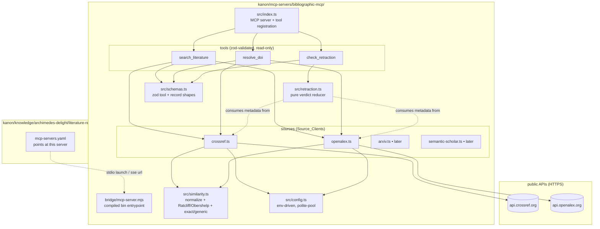
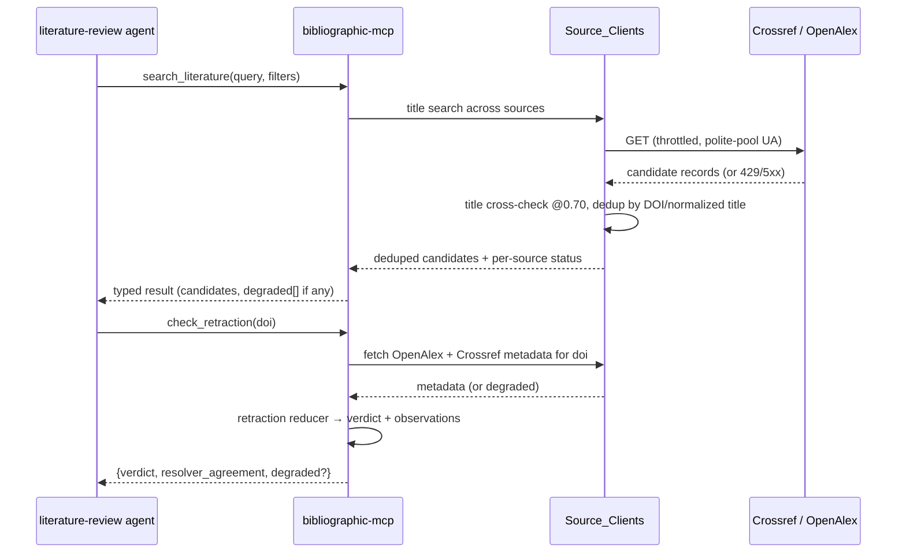

# Design Document

## Overview

Bibliographic MCP is a standalone, deterministic MCP server bundled at `kanon/mcp-servers/bibliographic-mcp/`, built the same way as the existing `souk-compass` server (Bun + TypeScript, `zod` schemas, a compiled bridge entrypoint, per-tool source files). It gives the Archimedes Delight `literature-review` agent a real literature-search and verification capability, replacing the `sse` placeholder that member currently declares.

Everything the server does is deterministic — HTTP calls to public bibliographic APIs plus string/regex/reducer logic. There are no LLM calls. The core logic is a TypeScript port of the deterministic bibliographic tooling in the sibling `academic-research-skills` (ARS) repository:

- `_text_similarity.py` → `src/similarity.ts` (title normalization, dotted-acronym pre-pass, CJK handling, exact/generic screens, Ratcliff/Obershelp ratio).
- `crossref_client.py`, `openalex_client.py` (and later `arxiv_client.py`, `semantic_scholar_client.py`) → `src/sources/*.ts` (DOI-first lookup with title cross-check, title fallback, throttle, backoff, graceful degradation).
- `retraction_status.py` → `src/retraction.ts` (pure reducer over already-fetched OpenAlex/Crossref metadata).

Because this is a derivative of ARS, which is **CC-BY-NC-4.0**, attribution and the non-commercial constraint are treated as design concerns, not afterthoughts (see Decisions §1 and Requirement 8).

The server does **not** touch Kanon's `src/`, catalog, schema, or adapters. Wiring into Archimedes Delight is a one-file change to `kanon/knowledge/archimedes-delight/literature-review/mcp-servers.yaml`, plus a one-line note update in that member's Data Access section.

## Architecture



### Agent-to-tool flow



## Components and Interfaces

### Directory layout (new, mirrors souk-compass)

```
kanon/mcp-servers/bibliographic-mcp/
├── package.json              # Bun + TS; bin: ./bridge/mcp-server.mjs; deps: @modelcontextprotocol/sdk, zod
├── tsconfig.json
├── biome.json                # or inherit; matches souk-compass tooling
├── README.md                 # tool docs + ARS attribution + CC-BY-NC notice
├── LICENSE / NOTICE          # ARS derivation + license terms
├── bridge/
│   └── mcp-server.mjs         # compiled entrypoint (bun build src/index.ts)
└── src/
    ├── index.ts               # MCP server, registers the tools
    ├── config.ts              # env-driven config (polite-pool email, transport, port)
    ├── schemas.ts             # zod: tool inputs/outputs, BiblioRecord, Verdict, SourceStatus
    ├── similarity.ts          # ARS _text_similarity port + Ratcliff/Obershelp
    ├── ratcliff.ts            # difflib-parity ratio (see Decisions §2)
    ├── retraction.ts          # ARS retraction_status reducer port (pure)
    ├── sources/
    │   ├── types.ts           # Source_Client interface, DegradedResult, throttle/retry helper
    │   ├── crossref.ts
    │   └── openalex.ts        # (arxiv.ts / semantic-scholar.ts added later)
    ├── tools/
    │   ├── search-literature.ts
    │   ├── resolve-doi.ts
    │   └── check-retraction.ts
    └── __tests__/
        ├── similarity.test.ts        # dotted-acronym, CJK, generic, exact
        ├── ratcliff.test.ts          # parity vs known difflib ratios
        ├── retraction.test.ts        # verdict reconciliation incl. disputed
        └── sources.test.ts           # mocked HTTP: 200/404/429/5xx/malformed
```

### `package.json` (shape, following souk-compass)

```jsonc
{
  "name": "@stevenjmiklovic/bibliographic-mcp",
  "version": "0.1.0",
  "type": "module",
  "bin": { "bibliographic-mcp": "./bridge/mcp-server.mjs" },
  "engines": { "bun": ">=1.4.2" },
  "scripts": {
    "test": "bun test",
    "typecheck": "bun x tsc --noEmit",
    "build": "bun build src/index.ts --target=bun --outfile=bridge/mcp-server.mjs --format=esm",
    "lint": "biome check .",
    "prepack": "bun run build"
  },
  "dependencies": { "@modelcontextprotocol/sdk": "^1.30.0", "zod": "^4" },
  "devDependencies": { "@biomejs/biome": "^2", "@types/bun": "latest", "fast-check": "^4", "typescript": "^5" },
  "license": "CC-BY-NC-4.0"
}
```

The `license` field is `CC-BY-NC-4.0` to reflect the ARS derivation (Decisions §1). `publishConfig`/publish is deliberately omitted until the licensing question (Requirement 8.2/8.3) is resolved.

### `src/similarity.ts` — ported interface

```typescript
export function normalizeTitle(s: string): string;          // base: lower, punct→space, collapse
export function normalizeTitleAcronym(s: string): string;   // + dotted-acronym pre-pass
export function normalizeCnTitle(s: string): string;        // CJK-aware
export function similarity(a: string, b: string): number;   // max over forms; CJK exact → 1.0
export function exactNormalizedTitle(a: string, b: string): boolean;
export function genericTitle(title: string): boolean;       // closed generic set

export const TITLE_SIMILARITY_THRESHOLD = 0.70;             // ARS-calibrated; see ratcliff.ts
```

`similarity` composes `ratcliff.ratio()` the same way ARS composes `SequenceMatcher.ratio()` — a `max` over the base and dotted-acronym normalizations, with a CJK exact-match short-circuit to `1.0`. The `0.70` threshold's ARS provenance (PaperOrchestra Appx D.3) is preserved in a code comment (Requirement 8.4).

### `src/ratcliff.ts` — difflib parity

A faithful Ratcliff/Obershelp `ratio()` that reproduces Python `difflib.SequenceMatcher.ratio()`, because the `0.70` threshold is calibrated against it (Decisions §2). Implemented in-repo (or a vetted npm equivalent, resolved during Task work) and pinned by `ratcliff.test.ts` against known Python outputs.

### `src/sources/types.ts` — Source_Client contract

```typescript
export type SourceStatus = "checked" | "degraded" | "not_checked";

export interface DegradedResult { status: "degraded"; source: string; reason: string; }

export interface BiblioRecord {
  source: string; doi?: string; title: string; year?: number;
  authors?: string[]; url?: string;
}

export interface SourceClient {
  readonly name: string;
  /** DOI lookup with mandatory title cross-check @0.70; null on miss/mismatch. */
  resolveDoi(doi: string, expectedTitle: string): Promise<BiblioRecord | null | DegradedResult>;
  /** Title/keyword search; returns candidates or a DegradedResult. */
  searchByTitle(query: string, limit: number): Promise<BiblioRecord[] | DegradedResult>;
}
```

A shared throttle + bounded-retry helper (429 → backoff × N, exhausted → `DegradedResult`; 404 → miss; 5xx/network/timeout/malformed → `DegradedResult`) lives here so each client stays thin, mirroring the ARS client structure. Each client validates its source's HTTPS host and redacts query strings from error text (Requirement 3.6).

### `src/tools/*` — MCP tool surface

| Tool | Input (zod) | Output (zod) | Maps to loop step |
|---|---|---|---|
| `search_literature` | `{ query, limit?, yearFrom?, yearTo? }` | `{ candidates: BiblioRecord[], degraded: DegradedResult[] }` | search |
| `resolve_doi` | `{ doi, expectedTitle }` | `{ record: BiblioRecord \| null, degraded?: DegradedResult }` | triage (verify a hit) |
| `check_retraction` | `{ doi }` | `{ verdict, resolverAgreement, observations[], degraded?: DegradedResult }` | triage (source-quality screen) |

Every tool is read-only and reports a per-source status so the agent can tell a genuine empty result from a `degraded` one (Requirement 5.2). Tool names/shapes match the `literature-review` member's documented loop (Requirement 5.4).

### `src/retraction.ts` — pure reducer

Port of ARS `retraction_status.py`'s reconciliation: `resolveRetractionVerdict(openalexMeta, crossrefMeta): { verdict: "retracted"|"not_retracted"|"reinstated"|"disputed"|"unknown", resolverAgreement, observations }`. No network I/O inside the reducer — the `check_retraction` tool fetches metadata via the source clients, then calls this. Unreconcilable resolver disagreement → `disputed`; no resolver reachable → `unknown` (Requirement 4.3). The reducer returns advisory data only; it does not judge citation legitimacy (Requirement 4.4).

## Data Models

All shapes are `zod` schemas in `src/schemas.ts`, local to this server — **no** Kanon schema (`kanon/src/schemas.ts`) changes. The only Kanon-side artifact is the MCP entry in the `literature-review` member's `mcp-servers.yaml`, which uses Kanon's existing discriminated-union MCP schema (`StdioMcpServerSchema` for a stdio launch, `UrlMcpServerSchema` for an SSE/HTTP endpoint).

## Wiring into Archimedes Delight

The Literature_Review_Member's `mcp-servers.yaml` changes from the placeholder to the bundled server. Default is a **stdio launch of the in-repo build** (works out of the box, no hosting *and no registry publish* required — which also sidesteps the CC-BY-NC "Sharing"/distribution question, since running the repo's own build is not public redistribution):

```yaml
- name: bibliographic-mcp
  command: bun
  args:
    - "run"
    - "${BIBLIOGRAPHIC_MCP_DIR}/bridge/mcp-server.mjs"
  env:
    # Polite-pool contact email for higher Crossref/OpenAlex rate limits.
    # Referenced as an env var, never a literal (Requirement 7.3 / archimedes 3.4).
    CROSSREF_POLITE_EMAIL: "${CROSSREF_POLITE_EMAIL}"
  autoApprove: []
```

`${BIBLIOGRAPHIC_MCP_DIR}` resolves to `kanon/mcp-servers/bibliographic-mcp` (the in-repo build). Publishing the package to a public registry and launching via `bunx @stevenjmiklovic/bibliographic-mcp` is an optional convenience, but because publishing is "Sharing" under CC-BY-NC §1.j it must carry the full §3.a attribution and stay within NonCommercial terms — so the in-repo launch is the default for an academic deployment. An SSE/HTTP alternative (for a shared JHU-hosted deployment) is documented in the server README:

```yaml
- name: bibliographic-mcp
  transport: sse
  url: "${BIBLIOGRAPHIC_MCP_URL}"   # e.g. https://<jhu-hosted>/mcp
  autoApprove: []
```

`autoApprove: []` by default; the three read-only tools may be listed once confirmed, per the read-only-only rubric inherited from the `archimedes-delight` spec. The `literature-review` member's agent-loop body is unchanged in structure — only its Data Access "current limitation" note is updated to say a working server is now wired in, with the search step no longer a placeholder (satisfies `archimedes-delight` Requirement 7.6).

## Error Handling

| Failure mode | Handling |
|---|---|
| Source returns 429 | Throttle + bounded backoff × N; exhausted → `DegradedResult` (Requirement 3.3) |
| Source returns 404 | Treated as a miss (no result), not an error (Requirement 3.4) |
| Source 5xx / timeout / network / malformed body | `DegradedResult` returned to the tool, surfaced to the agent; never throws (Requirement 3.4) |
| DOI resolves but title cross-check < 0.70 | Treated as a mismatch → no result, so a wrong-DOI record is never returned as a match |
| All resolvers unreachable for a retraction check | Verdict `unknown` with a degradation note (Requirement 4.3) |
| Resolvers give unreconcilable retraction verdicts | Verdict `disputed`, not an arbitrary pick (Requirement 4.3) |
| Polite-pool email would appear in an error message | Query string redacted from error text and logs (Requirement 3.6 / 7.4) |
| `kanon validate --security` on the wired `mcp-servers.yaml` | No literal credential — email is `${ENV_VAR}` (Requirement 6.5) |
| Academic (non-commercial) use of the ARS-derived logic | Permitted — CC-BY-NC-4.0 §2.a.1.b grants the port for NonCommercial purposes; obligations are attribution (§3.a) + NC-compatible licensing (§3.a.4), both satisfied by the `NOTICE`/`README` and the `CC-BY-NC-4.0` license field (Requirement 8.1/8.2, Decisions §1) |
| Future commercial distribution channel | Only then a concern — keep the ported logic out of that channel or clean-room re-derive it; not required for academic in-repo/self-host use (Requirement 8.3) |

## Testing Strategy

The server has its own `bun test` suite (unlike the content-only archimedes-delight collection):

- **`similarity.test.ts`** — pins the ported normalization/identity/generic behavior against fixtures, including ≥1 dotted-acronym and ≥1 CJK case (Requirement 2.5).
- **`ratcliff.test.ts`** — asserts the ratio matches known Python `difflib.SequenceMatcher.ratio()` outputs for a fixture set, guarding the `0.70` threshold's validity (Requirement 2.2, Decisions §2).
- **`retraction.test.ts`** — exercises the reducer over crafted OpenAlex/Crossref metadata, including `retracted`, `not_retracted`, `reinstated`, `disputed`, and `unknown` (Requirement 4).
- **`sources.test.ts`** — mocked HTTP for each client: 200 hit, 404 miss, 429-then-success, 429-exhausted → degraded, 5xx → degraded, malformed body → degraded, and DOI/title cross-check pass/fail (Requirement 3).
- **Wiring check** — after Task work, `kanon validate` and `kanon validate --security` on the updated `literature-review/mcp-servers.yaml` (Requirement 6.4, 6.5).
- Optional **property tests** (`fast-check`, as souk-compass uses) for similarity invariants (e.g. `similarity(x, x) === 1.0`, symmetry).

## Correctness Properties

Invariants the implementation must hold, suitable for property/unit tests.

### Property 1: Self-similarity
`similarity(x, x) === 1.0` for any non-empty title.
**Validates: Requirements 2.1, 2.3**

### Property 2: Symmetry
`similarity(a, b) === similarity(b, a)`.
**Validates: Requirements 2.1**

### Property 3: Bounded
`0.0 <= similarity(a, b) <= 1.0` always.
**Validates: Requirements 2.1, 2.2**

### Property 4: difflib parity
`ratcliff.ratio(a, b)` equals Python `difflib.SequenceMatcher(None, a, b).ratio()` for the fixture set, so the `0.70` threshold behaves as ARS calibrated it.
**Validates: Requirements 2.2**

### Property 5: Exact implies match
If `exactNormalizedTitle(a, b)` is true then `similarity(a, b) === 1.0` (the max-over-forms composition never lowers an exact match).
**Validates: Requirements 2.1, 2.3**

### Property 6: DOI cross-check gate
`resolveDoi(doi, title)` returns a record only when the resolved title passes the `0.70` cross-check; a DOI hit with a mismatched title yields a miss, never a wrong-record match.
**Validates: Requirements 3.2**

### Property 7: Degradation is typed, never thrown
For any source failure (5xx, timeout, network, malformed body, exhausted 429 retries), a client returns a `DegradedResult`; no tool call throws on source unavailability.
**Validates: Requirements 3.3, 3.4, 5.2**

### Property 8: 404 is a miss, not a degradation
A source 404 yields "no result" with `checked` status, distinct from a `DegradedResult`.
**Validates: Requirements 3.4, 5.2**

### Property 9: Reducer purity
`resolveRetractionVerdict` performs no I/O; the same inputs always produce the same verdict.
**Validates: Requirements 4.1**

### Property 10: Honest verdicts
Unreconcilable resolver disagreement yields `disputed`; no reachable resolver yields `unknown`. The reducer never fabricates a definite verdict from conflicting or absent evidence.
**Validates: Requirements 4.3, 4.4**

### Property 11: Read-only surface
No exposed tool mutates external state.
**Validates: Requirements 5.5**

### Property 12: No credential leakage
No polite-pool email or credential appears in any tool output, error message, or log line.
**Validates: Requirements 3.6, 7.4**

## Decisions and Trade-offs

1. **License is CC-BY-NC-4.0; the academic (non-commercial) context permits the port.** The deterministic logic is an adaptation of ARS (© 2026 Cheng-I Wu, CC-BY-NC-4.0). This server is built for and used in an academic research computing environment (JHU faculty/staff), which is **NonCommercial** use as the license defines it — and CC-BY-NC-4.0 §2.a.1.b **expressly grants** producing and Sharing Adapted Material, including a TypeScript port, for NonCommercial purposes. So the port is permitted; it is not a blocked path requiring clean-room re-derivation. What remains are two obligations, both routine: (a) **attribution** under §3.a — a `NOTICE`/`README` carrying creator, copyright, license reference, warranty disclaimer, source link, and a "modified: ported to TypeScript" indication; and (b) **NC-compatible downstream licensing** under §3.a.4 — the port is licensed CC-BY-NC-4.0 (not relabeled MIT/permissive), so the server's `license` field is `CC-BY-NC-4.0`. The one remaining caution is **distribution channel**: publishing to a public registry is "Sharing" and carries the attribution + NC conditions with it, and the server must not be folded into a commercially-distributed product. Clean-room re-derivation is therefore a *contingency* reserved only for a future commercial channel, not the default path.
2. **Faithful Ratcliff/Obershelp, not a Levenshtein substitute.** ARS's `0.70` match threshold is calibrated against `difflib.SequenceMatcher.ratio()` (Ratcliff/Obershelp). A different metric (Levenshtein, Jaro-Winkler) would produce different scores and silently break the threshold, turning correct matches into misses or vice versa. The port therefore reproduces the difflib ratio, pinned by parity tests. Whether that is an in-repo implementation or a vetted npm package is a Task-time decision, but the parity requirement is fixed.
3. **Bundle like souk-compass, don't extend the kanon CLI.** Kanon is a compiler with no runtime for artifacts to call, so a research utility must be a separate MCP server the artifact points at — exactly the souk-compass pattern. This keeps zero changes to `kanon/src/`, catalog, schema, or adapters.
4. **stdio default, SSE/HTTP optional.** A stdio launch (`bunx`) works out of the box for a single user with no hosting, so it is the default wiring. A shared JHU-hosted SSE/HTTP endpoint is documented as the alternative for multi-user deployment. This resolves the first Open Question toward the zero-config path while leaving the hosted path available.
5. **Crossref + OpenAlex first; arXiv / Semantic Scholar later.** Crossref (DOI/metadata) and OpenAlex (metadata + retraction flags) together cover search, resolution, and retraction with the fewest clients. arXiv (preprints) and Semantic Scholar (citation graph) share the same `similarity.ts` core and `SourceClient` interface, so adding them later is additive and needs no tool-layer change (Requirement 3.1).
6. **Retraction reducer stays pure.** Keeping network I/O out of the reducer (fetch in the tool, reconcile in the reducer) matches ARS's structure, makes the reducer trivially testable with crafted metadata, and keeps the "advisory data, not a legitimacy judgment" boundary clean (Requirement 4.4).

## Open Questions carried to tasks

- Confirm whether a vetted npm Ratcliff/Obershelp package matches `difflib` exactly, or implement `ratcliff.ts` in-repo (Decisions §2).
- Confirm the CC-BY-NC-4.0 constraint against the intended distribution before any publish step (Decisions §1 / Requirement 8.2).
- Decide the initial `autoApprove` list once the three tools' read-only status is confirmed against a running server (Requirement 6.2).
