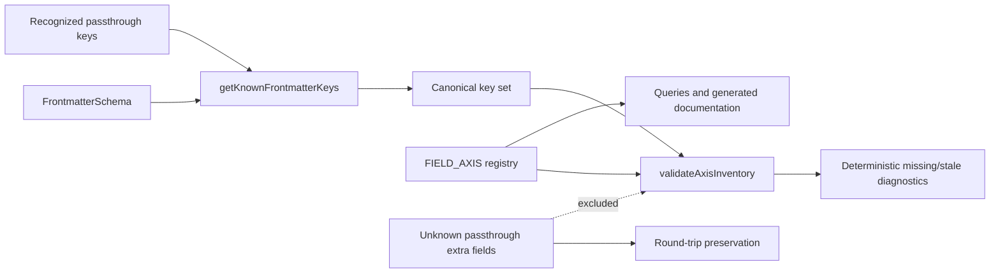
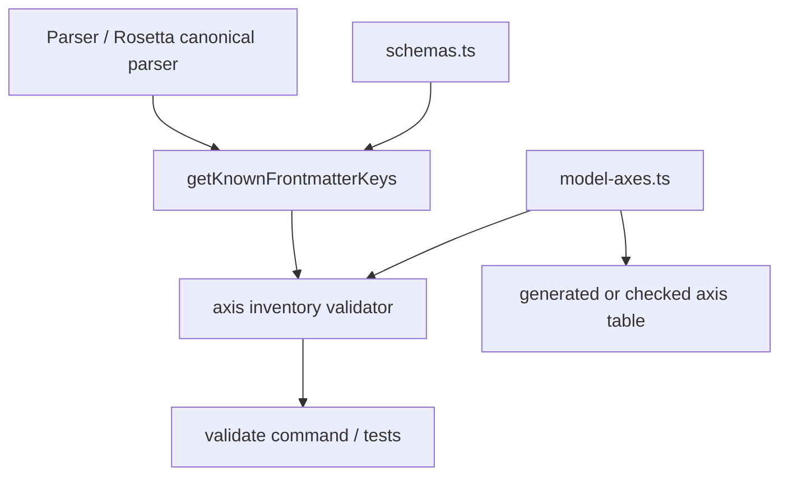

# Design Document: Complete Axis Inventory

## Contract

Apply the Kiro Spec Design contract (anchors: C4 Diagrams and ADRs): show the relevant component relationships, then record significant choices with context, decision, and consequences.

## Overview

The implementation adds a total, machine-checkable inventory over Kanon's recognized canonical frontmatter keys. It does not add metadata. The design replaces the stale draft's assumptions with the current architecture:

- `getKnownFrontmatterKeys()` is the canonical key authority.
- `harness-config` is a recognized validated passthrough key.
- Arbitrary passthrough keys remain extensions and are outside total coverage.
- `outcomes` is intrinsic Behavior, not Destination metadata.
- `type`, format, asset compatibility, feature capability, and distribution channel remain independent concepts.
- Validation checks set equality; it does not search arbitrary prose for vendor names.

## Reference-Repository Findings

| Repository | Canonical categorical design | Reusable lesson | Kanon delta |
|---|---|---|---|
| Academic Research Skills | Four functional skills; modes scoped by skill; separate spectrum, oversight, task type, data access, phase/write scope, install channel, and mechanism availability | Use composite identities for scoped values; separate channel from harness; represent active/conditional/absent or degraded behavior explicitly | Kanon has broader artifact types and nine adapters; it does not currently model modes or channels in frontmatter |
| SciAgent-Skills | One primary domain category; one behavioral subtype; sparse multi-valued tags; bundled resources by role; registry↔file bijection | Keep category, subtype, tags, and resources orthogonal; enforce both missing and extra inventory entries | Kanon categories are multi-valued and currently functional; no persisted subtype or tag field exists |
| Kanon | Canonical asset type, categories, ecosystem, relations, governance, outcomes, origin, and harness distribution | Inventory recognized keys without changing their semantics | Rosetta contracts own format variants; compatibility and capability matrices answer separate support questions |

## Axis Model

| Axis | Question | Current canonical keys | Cardinality / authority |
|---|---|---|---|
| Identity | How is the artifact identified and described? | `name`, `displayName`, `description`, `keywords`, `author`, `id` | One artifact identity; schema owns field shapes |
| Structure | What canonical kind is it? | `type` | Exactly one `AssetType`; `power` is deprecated alias |
| Classification | Which controlled semantic classes describe it? | `categories` | Zero or more values from `CATEGORIES` |
| Applicability | Which technical contexts does it apply to? | `ecosystem` | Zero or more kebab-case values |
| Relation | How does it connect to other artifacts or groups? | `depends`, `enhances`, `collections` | Directed edges plus group membership |
| Governance | How is it handled, trusted, exposed, and ordered? | `license`, `trust`, `risk-level`, `audience`, `model-assumptions`, `visibility`, `priority` | Field-specific controlled/free vocabularies |
| Lifecycle | What is its version and replacement state? | `version`, `maturity`, `migrations`, `successor`, `replaces` | Field-specific state and directed succession |
| Behavior | What result or operating contract does it declare? | `outcomes` | Zero or more globally identified outcomes |
| Origin | Where did it come from and how is it credited? | `provenance`, `attribution` | Machine-managed source plus curation-owned credit |
| Distribution | Where and under what inclusion/format controls is it emitted? | `harnesses`, `inclusion`, `file_patterns`, `harness-config`, `inherit-hooks` | Harness set plus target-specific controls |

There is intentionally no Subject axis in the current implementation because `domains` is not a canonical key. There is intentionally no persisted Profile, Tag, Mode, Resource Role, or Distribution Channel field. Those concepts are extension candidates, not invented current state.

## Architecture



### C4 Component View



## Components and Interfaces

### 1. Axis Registry

Create `src/model-axes.ts` as a declarative module. Object structures use explicit interfaces and readonly fields.

```typescript
export const AXES = [
  "identity",
  "structure",
  "classification",
  "applicability",
  "relation",
  "governance",
  "lifecycle",
  "behavior",
  "origin",
  "distribution",
] as const;

export type AxisName = (typeof AXES)[number];

export interface AxisDefinition {
  readonly name: AxisName;
  readonly question: string;
  readonly fields: readonly string[];
}

export const FIELD_AXIS = {
  name: "identity",
  displayName: "identity",
  description: "identity",
  keywords: "identity",
  author: "identity",
  id: "identity",
  type: "structure",
  categories: "classification",
  ecosystem: "applicability",
  depends: "relation",
  enhances: "relation",
  collections: "relation",
  license: "governance",
  trust: "governance",
  "risk-level": "governance",
  audience: "governance",
  "model-assumptions": "governance",
  visibility: "governance",
  priority: "governance",
  version: "lifecycle",
  maturity: "lifecycle",
  migrations: "lifecycle",
  successor: "lifecycle",
  replaces: "lifecycle",
  outcomes: "behavior",
  provenance: "origin",
  attribution: "origin",
  harnesses: "distribution",
  inclusion: "distribution",
  file_patterns: "distribution",
  "harness-config": "distribution",
  "inherit-hooks": "distribution",
} as const satisfies Readonly<Record<string, AxisName>>;
```

`FIELD_AXIS` is the machine authority. `AXIS_DEFINITIONS` SHALL be derived from it or tested against it rather than maintaining another unconstrained field list.

### 2. Canonical Key Authority

Reuse `getKnownFrontmatterKeys()` from `src/rosetta/canonical.ts`. The helper already accounts for optional fields and recognized passthrough keys without navigating private Zod internals.

The parser's deprecated `KNOWN_FRONTMATTER_FIELDS` is a competing inventory. The preferred implementation changes parser extra-field splitting to consume the canonical helper. If dependency layering prevents that import, extract key derivation into a neutral module consumed by both parser and Rosetta; do not add a third hand-maintained list.

### 3. Inventory Validation

```typescript
export interface AxisInventoryDiagnostic {
  readonly code: "missing-axis-assignment" | "stale-axis-assignment";
  readonly field: string;
  readonly message: string;
}

export function validateAxisInventory(
  knownFields: ReadonlySet<string>,
  fieldAxis: Readonly<Record<string, AxisName>>,
): readonly AxisInventoryDiagnostic[] {
  // Return all missing keys, then all stale keys, each lexicographically sorted.
}
```

This is a model self-check, not artifact-content validation. It runs in tests and may run at validation startup. It must not emit one warning per artifact for the same registry defect.

### 4. Extension Classification Rules

| Proposed concept | Default placement | Required decision before persistence |
|---|---|---|
| `profile` / `sub_type` | Structure | Closed values, type applicability, and whether identity is `(type, profile)` |
| `tags` / domain facets | Classification | Single versus multi-value, controlled vocabulary, aliases, and overlap with categories |
| mode | Behavior | Scope key, composite identity, triggers, and whether it changes output contract |
| spectrum / oversight / task type | Behavior or Governance | Controlled values and per-artifact constraints |
| data-access level | Governance | Allowed values and artifact-specific pins |
| resource roles | Structure below artifact level | Directory/file authority and registry inclusion |
| distribution channel | Distribution | Harness relationship, support state, degradation reason, and installation target |

This table incorporates the reference repositories without copying their values into Kanon's schema.

## Key Distinctions

### Asset Type Versus Artifact Profile

`type` is Kanon's broad canonical kind. SciAgent's subtype answers a narrower content-architecture question. If Kanon adopts profiles, they must be constrained by type rather than added to `AssetTypeSchema` as harness-flavored values.

### Category Versus Tags

SciAgent uses one primary category plus optional tags. Kanon currently permits multiple controlled categories and has `keywords` for discovery. This design preserves current behavior. A future tags field would be Classification metadata with explicit non-redundancy and vocabulary rules.

### Behavior Versus Distribution

An outcome, mode, or oversight level describes what the artifact promises or how it operates. A harness format describes representation at an edge. The same behavior can be represented natively, adapted, or degraded per harness.

### Harness Versus Distribution Channel

Academic Research Skills shows that one harness can be consumed through plugin, copied-skill, repository, or wrapper channels with different active controls. Kanon currently models Harness only. Any channel model must be a separate key and must not overload `harnesses`.

## Data Models

The feature adds no persisted data. Its in-memory model consists of:

- `AxisName`: the closed ten-value union.
- `FIELD_AXIS`: a readonly canonical-key-to-axis record.
- `AxisDefinition`: a derived documentation/query view containing an axis name, question, and fields.
- `AxisInventoryDiagnostic`: a typed missing/stale assignment result.

`Frontmatter`, `KnowledgeArtifact`, and `CatalogEntry` remain unchanged. Unknown passthrough data remains in `extraFields` and is deliberately outside `FIELD_AXIS`.

## Correctness Properties

### Property 1: Total canonical coverage

For the key set returned by `getKnownFrontmatterKeys()` and the keys of `FIELD_AXIS`, both set differences are empty.

**Validates: Requirements 1.3, 2.1, 8.1, 8.2**

### Property 2: Deterministic drift reporting

For any two finite key sets, inventory validation reports every missing and stale key exactly once in stable order.

**Validates: Requirements 8.1, 8.2, 8.3, 8.6**

### Property 3: Extra-field preservation boundary

For any unknown passthrough key that does not collide with a Canonical_Key, canonical parse/serialize preserves the field while total coverage remains unchanged.

**Validates: Requirements 2.4, 9.1**

### Property 4: Structural-format independence

For any valid artifact, changing only `type` does not change `resolveFormat()` output for any harness.

**Validates: Requirements 3.4, 9.2**

### Property 5: Documentation parity

The documented field-to-axis assignments equal `FIELD_AXIS`.

**Validates: Requirements 10.1, 10.2**

### Property 6: Behavior preservation

For the existing corpus, inventory implementation does not change parsed frontmatter, catalog entries, or adapter output.

**Validates: Requirements 9.1, 9.2, 9.3, 9.4**

## Error Handling

| Condition | Severity | Response |
|---|---|---|
| Canonical key missing from `FIELD_AXIS` | Error | Name the key; fail inventory validation |
| Stale `FIELD_AXIS` key | Error | Name the key; fail inventory validation |
| Duplicate field in a generated axis definition | Error | Fail registry construction/test |
| Unknown passthrough field | None | Preserve as `extraFields`; do not classify automatically |
| Harness-like word in free text | None | Do not infer a categorical violation |
| Parser/Rosetta key authorities disagree | Error | Fail parity test and identify both differences |

## Testing Strategy

Use Bun for all checks. Targeted tests cover the pure set logic, real canonical key parity, parser/Rosetta parity, extra-field round trips, type/format independence, and documentation parity. A corpus smoke test verifies unchanged catalog/build behavior. Property-based tests with `fast-check` are appropriate for set-difference and unknown-key round-trip properties.

## ADR Update

Refresh proposed ADR-0069 with these decisions:

- Replace Craft/Subject/Presentation/Destination framing with the current ten-axis model.
- Remove nonexistent `domains`.
- Place `collections` on Relation and `outcomes` on Behavior.
- Define Canonical_Key through `getKnownFrontmatterKeys()`.
- Exclude arbitrary passthrough keys from total coverage.
- Reject generic recursive vendor-name scanning.
- Record the reference-repository evidence and the extension-classification table.
