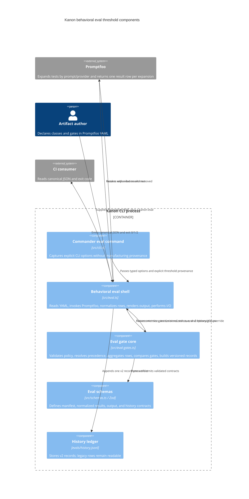

# Design: Per-Class Behavioral Eval Thresholds

## Semantic Contract

Apply the **Kiro Spec Design contract** (anchors: **C4 Diagrams** and **Architecture Decision Records (ADR, Michael Nygard)**). This document applies the C4 anchor as a component view of the behavioral-eval runtime and applies the ADR anchor as short Context/Decision/Consequences records for each significant architectural choice. The contract body travels here with its coined name; it is not used as a bare label.

## Overview

Kanon's standard behavioral eval path accepts `--threshold`, but does not enforce it: `evalCommand` parses the option, `runEvals` assigns it to unused `_threshold`, and the command exits non-zero when any result row fails. The current path also counts provider/runtime failures as behavioral score zero, writes unversioned JSON, and records all results under the first artifact in legacy history.

This design adds a backward-compatible top-level `x-kanon-eval` extension to Promptfoo YAML. The extension declares stable behavioral classes, aggregate and per-class quality gates, and advisory metrics. Kanon removes the extension before invoking Promptfoo, classifies each opted-in test only from standard `metadata.kanon.class`, evaluates deterministic gates in a pure core, and reserves a separate run status for configuration and operational failures.

The resulting command contract is:

- Exit `0`: every configured quality gate passes and no operational error occurred.
- Exit `1`: at least one quality gate fails and no operational error occurred.
- Exit `2`: configuration validation fails, a configured gate has zero samples, Promptfoo cannot run, or any provider/runtime error occurs.

No source changes are part of this design task. Implementation must create **ADR-0072** if `0072` is still the next available number, because this design establishes a versioned eval-manifest contract and quality-gate/exit semantics.

## Goals and Non-Goals

### Goals

- Enforce aggregate and per-class behavioral quality gates with explicit, versioned configuration.
- Keep ordinary Promptfoo configuration valid by stripping only Kanon's extension before evaluation.
- Preserve assertion failures as behavioral evidence while separating provider/runtime failures as operational errors.
- Preserve current JSON fields additively and retain a reader for unversioned legacy history.
- Make `--ci` deterministic and machine-readable.
- Pilot explicit classes on the Archimedes Delight router.

### Non-Goals

- Inferring classes from test descriptions, comments, assertion text, prompt content, or artifact names.
- Applying behavioral thresholds to mutation testing or the Kiro progressive-steering rubric.
- Redesigning Promptfoo assertions, providers, retries, or namespaced eval discovery.
- Migrating every existing eval suite to per-class gates in the first release.
- Creating an ADR in this design-only change.

## Version 1 Manifest Contract

The extension is optional. Existing Promptfoo configs without `x-kanon-eval` remain valid and receive the effective aggregate default described under CLI precedence.

```yaml
x-kanon-eval:
  version: 1
  classes:
    - id: direct-routing
      description: Single-intent requests route to one correct member.
    - id: ambiguity
      description: Underspecified requests trigger clarification.
    - id: multi-intent
      description: Multi-part requests are sequenced across research phases.
    - id: role-boundary
      description: The router hands work off instead of performing it.
  gates:
    aggregate:
      metric: pass_rate
      operator: ">="
      threshold: 0.80
    perClass:
      direct-routing:
        metric: pass_rate
        operator: ">="
        threshold: 0.85
      ambiguity:
        metric: pass_rate
        operator: ">="
        threshold: 0.75
      multi-intent:
        metric: mean_score
        operator: ">="
        threshold: 0.70
      role-boundary:
        metric: failure_rate
        operator: "<="
        threshold: 0.10
  metrics:
    advisory:
      - failure_rate
      - mean_score

tests:
  - description: Literature survey routes to literature-review
    metadata:
      kanon:
        class: direct-routing
    vars:
      user_query: Review the literature on intermittent fasting.
    assert:
      - type: icontains
        value: literature-review
```

### Validation Rules

- `version` must equal `1`; unknown versions are configuration errors.
- Class IDs are unique, stable, non-empty kebab-case strings matching `^[a-z0-9]+(?:-[a-z0-9]+)*$`.
- A class used by a test or `gates.perClass` must be declared in `classes`.
- A test opts into classification only by declaring test-local `metadata.kanon.class`.
- An opted-in test has exactly one scalar class. Arrays, empty values, inherited `defaultTest` classification, and multiple class-bearing fields are invalid.
- Tests without class metadata remain aggregate-only for backward-compatible incremental migration.
- Class is never inferred from `description`, comments, assertions, prompt text, ordering, or naming conventions.
- `gates.aggregate` is optional in the file but always resolved to one effective aggregate gate.
- `gates.perClass` is optional. Each key identifies one configured class gate.
- Supported metrics are `pass_rate`, `failure_rate`, and `mean_score`.
- Supported operators are `>=`, `<=`, `>`, and `<`.
- Direction consistency is mandatory: `pass_rate` and `mean_score` accept only `>=` or `>`; `failure_rate` accepts only `<=` or `<`.
- Thresholds must be finite numbers in `[0, 1]`.
- `metrics.advisory` is a unique list of metric names. Its schema has no operator or threshold fields, so advisory metrics are structurally incapable of gating.
- Unknown keys inside `x-kanon-eval` are rejected for version 1. Promptfoo keys outside the extension remain under Promptfoo's compatibility rules.

## C4 Component View



### Architectural Boundary

`src/eval-gates.ts` is the deterministic core. It performs no filesystem access, process exit, clocks, Git calls, terminal rendering, or Promptfoo imports. `src/eval.ts` remains the thin I/O shell and owns YAML reads, Promptfoo invocation, row adaptation, retries, output destinations, history append, and final exit-code propagation.

`src/schemas.ts` remains the source of truth for runtime contracts, consistent with ADR-0002. Types are inferred from Zod schemas rather than duplicated manually.

## Components and Interfaces

### 1. Central Zod Schemas (`src/schemas.ts`)

Implementation adds and exports schemas and inferred types for:

- `EvalClassIdSchema`
- `EvalMetricSchema`
- `EvalComparisonOperatorSchema`
- `EvalGateRuleSchema`
- `KanonEvalManifestV1Schema`
- `NormalizedEvalRowSchema`
- `EvalMetricSummarySchema`
- `EvalGateDecisionSchema`
- `BehavioralEvalOutputSchema`
- `EvalHistoryV2Schema`
- `LegacyEvalHistorySchema`

The manifest schema uses a discriminated version field. Future versions add a new union member rather than weakening version 1.

### 2. Pure Gate Core (`src/eval-gates.ts`)

The core exposes functions equivalent to the following contracts; final names may follow existing module naming conventions, but responsibilities must not move into the shell.

```typescript
interface PreparedEvalConfig {
  readonly promptfooConfig: Record<string, unknown>;
  readonly manifest: KanonEvalManifestV1 | null;
}

interface CliThresholdOverride {
  readonly isExplicit: boolean;
  readonly value?: number;
}

interface EffectiveGatePolicy {
  readonly aggregate: EffectiveGateRule;
  readonly perClass: Readonly<Record<string, EvalGateRule>>;
  readonly advisoryMetrics: readonly EvalMetric[];
  readonly aggregateSource: "cli" | "manifest" | "default";
}

function prepareEvalConfig(config: unknown): PreparedEvalConfig;
function resolveGatePolicy(
  manifest: KanonEvalManifestV1 | null,
  cliThreshold: CliThresholdOverride,
): EffectiveGatePolicy;
function aggregateEvalRows(
  rows: readonly NormalizedEvalRow[],
  policy: EffectiveGatePolicy,
): EvalAggregation;
function compareGate(actual: number, rule: EvalGateRule): boolean;
function evaluateGatePolicy(
  aggregation: EvalAggregation,
  policy: EffectiveGatePolicy,
): EvalGateEvaluation;
```

`prepareEvalConfig` shallow-copies the top-level config, removes `x-kanon-eval`, validates the extension and classification references, and returns the Promptfoo-safe config. It must not remove standard test metadata; `metadata.kanon.class` is the correlation mechanism that survives prompt/provider expansion.

The same module provides pure construction/normalization helpers for additive JSON and history v2, including a legacy-history parser that normalizes unversioned entries into the trend reader's internal view.

### 3. Promptfoo Shell (`src/eval.ts`)

The shell processes each discovered config in this order:

1. Parse YAML as `unknown`.
2. Call `prepareEvalConfig` before prompt reference resolution or provider overrides.
3. Resolve the effective gate policy from manifest, explicit CLI provenance, or default.
4. Invoke Promptfoo with `promptfooConfig`; `x-kanon-eval` must be absent.
5. Normalize each Promptfoo result into a discriminated row.
6. Aggregate behavioral rows and compute provisional metrics.
7. Evaluate aggregate and per-class gates.
8. Derive config/run status and render human or CI output.
9. Optionally append grouped v2 history.
10. Return the highest-severity exit code across all configs.

The shell must not match result rows back to source tests by description. It reads the class from each result row's standard `testCase.metadata.kanon.class`. If Promptfoo fails to preserve class metadata for an opted-in expanded row, the row is an operational error because its configured class cannot be proven.

### 4. Commander Wiring (`src/cli.ts`)

Remove the Commander default from `--threshold` so absence is distinguishable from an explicit value. Update help text to identify it as the aggregate pass-rate threshold.

Commander continues to parse command syntax under ADR-0006. `evalCommand` receives a typed options interface and determines whether `--threshold` was explicitly present from the absence/presence of the option after removal of the Commander default. Invalid, non-finite, or out-of-range CLI values are configuration errors and exit `2`.

Mutation testing retains its own default and semantics. Progressive steering continues to ignore behavioral `--threshold`; its 0–100 Green/Yellow/Red rubric remains a separate mode.

## Row Classification and Aggregation

### Normalized Row Outcomes

Each Promptfoo result becomes exactly one of these outcomes:

- `behavior-pass`: Promptfoo returned no provider/runtime error and the assertion result succeeded.
- `behavior-fail`: Promptfoo returned no provider/runtime error and an assertion failed.
- `operational-error`: the row reports a provider/runtime error or cannot be normalized safely.

A thrown Promptfoo/config execution exception is a config-level operational error, not a synthetic row with score zero.

### Aggregation Unit

One Promptfoo result row is one aggregation row. Prompt/provider expansion therefore increases sample counts. For example, one classified test expanded across two prompts and three providers contributes six samples to its class when all six rows are behavioral outcomes.

For each aggregate and class summary, expose:

- `totalRows`: all expanded rows in scope.
- `sampleCount`: behavioral pass plus behavioral fail rows.
- `passedSamples`: behavioral passes.
- `failedSamples`: assertion failures.
- `operationalErrorCount`: provider/runtime/normalization errors.

Operational errors do not enter behavioral metric denominators and are never converted to score zero.

### Metric Formulas

For a scope with `sampleCount > 0`:

```text
pass_rate   = passedSamples / sampleCount
failure_rate = failedSamples / sampleCount
mean_score  = sum(normalized behavioral row scores) / sampleCount
```

A behavioral row without a score uses `1` for pass and `0` for assertion failure, matching the current fallback. A non-finite normalized score is an operational error; the implementation must not clamp or silently coerce it.

The aggregate scope contains every behavioral row, including unclassified tests. A class scope contains every expanded behavioral row whose test declares that class.

### Gate Conjunction

The effective aggregate gate and every configured per-class gate are conjunctive. A config passes only when all of them pass. A command spanning multiple configs passes only when every config passes.

A configured gate with zero behavioral samples is an operational error, including an aggregate gate when no behavioral rows ran and a per-class gate whose class produced no behavioral samples. It is not evaluated as metric zero.

When operational errors are mixed with behavioral rows, Kanon computes and reports provisional metrics from the behavioral rows but the config and run status are `error`, producing exit `2`. A provisional gate failure does not downgrade or replace the operational error.

## CLI Threshold Precedence

Resolve each config's effective aggregate gate in this order:

1. If `--threshold` is explicit:
   - If the manifest has no aggregate gate, synthesize `pass_rate >= <cli-value>`.
   - If the manifest aggregate metric is `pass_rate`, replace only its threshold with the CLI value and retain its valid `>=` or `>` operator.
   - If the manifest aggregate metric is `failure_rate` or `mean_score`, reject the conflict as a configuration error. Kanon must not reinterpret a CLI pass-rate value as another metric.
2. Otherwise, use the manifest aggregate gate when present.
3. Otherwise, synthesize `pass_rate >= 0.70`.

Per-class gates are always manifest-owned and are never changed by `--threshold`.

The output records the effective aggregate gate and `aggregateSource` (`cli`, `manifest`, or `default`) so provenance is inspectable.

## Output Contracts

### Human Output

Interactive output retains per-row diagnostics and adds:

- Aggregate and per-class metric summaries with sample/error counts.
- Effective gate rules and provenance.
- Pass/fail markers per gate.
- A distinct operational-error summary.

Assertion failures may show model output and judge reason. Provider/runtime errors show sanitized operational context and must not include credentials, authorization headers, tokens, or entire provider/request objects.

### Additive JSON Output

The existing `EvalResult[]` fields remain present: `configFile`, `artifactName`, `totalTests`, `passed`, `failed`, `score`, and `details`. New fields are additive:

```json
{
  "configFile": "knowledge/example/evals/routing.yaml",
  "artifactName": "example",
  "totalTests": 12,
  "passed": 10,
  "failed": 2,
  "score": 0.8333333333333334,
  "details": [],
  "status": "pass",
  "manifestVersion": 1,
  "effectivePolicy": {
    "aggregateSource": "manifest",
    "aggregate": { "metric": "pass_rate", "operator": ">=", "threshold": 0.8 },
    "perClass": {}
  },
  "metrics": {
    "aggregate": {
      "totalRows": 12,
      "sampleCount": 12,
      "passedSamples": 10,
      "failedSamples": 2,
      "operationalErrorCount": 0,
      "pass_rate": 0.8333333333333334,
      "failure_rate": 0.16666666666666666,
      "mean_score": 0.82
    },
    "perClass": {}
  },
  "gates": [],
  "operationalErrors": []
}
```

For legacy configs, `manifestVersion` is `null`; the effective default or CLI policy is still included. Existing `failed` continues to mean behavioral assertion failures, not operational errors. `totalTests` remains the behavioral sample count for compatibility; the new counts remove ambiguity.

### `--ci` Canonical JSON

`--ci` selects canonical JSON for the standard behavioral path:

- Recursively sort object keys while retaining stable array order.
- Emit exactly one JSON document to stdout followed by one newline.
- If `--output` is also supplied, write identical bytes to that path as an additional sink.
- Suppress decorative banners, progress bars, colors, success messages, and retry decoration on stderr.
- Represent config and operational diagnostics in the JSON document whenever serialization is possible.
- Retain existing retry behavior, but do not let retries alter the final row/gate semantics.

Progressive steering keeps its existing, separate canonical JSON and threshold model.

## History v2

The writer appends version 2 records only. It groups results by `artifactName` and writes one record per artifact per command run, preventing the current `results[0].artifactName` misattribution.

```json
{
  "version": 2,
  "ts": "2026-01-01T00:00:00.000Z",
  "sha": "abc1234",
  "artifact": "archimedes-delight",
  "status": "pass",
  "configs": [
    {
      "configFile": "knowledge/archimedes-delight/archimedes-delight/evals/routing.yaml",
      "status": "pass",
      "aggregate": {},
      "perClass": {},
      "gates": [],
      "operationalErrorCount": 0
    }
  ],
  "total": {
    "sampleCount": 12,
    "passedSamples": 12,
    "failedSamples": 0,
    "operationalErrorCount": 0,
    "pass_rate": 1
  }
}
```

The exact nested objects use the same schemas as additive JSON output rather than parallel hand-written shapes.

The history reader accepts both:

- Legacy unversioned entries with `ts`, `sha`, `artifact`, `scores`, and `total`.
- Version 2 entries with grouped config/class metrics and gate status.

Legacy entries normalize to an internal trend view without inventing class data or threshold provenance. Malformed or unsupported-version lines produce clear diagnostics rather than unchecked casts. Existing ledger lines are not rewritten.

## Run Status and Exit Codes

Status precedence is deterministic:

1. `error` if any config or operational error exists, including zero-sample configured gates.
2. Otherwise `fail` if any aggregate or per-class gate fails.
3. Otherwise `pass`.

The CLI maps status to exit codes:

| Status | Exit | Meaning |
|---|---:|---|
| `pass` | 0 | All configured quality gates passed. |
| `fail` | 1 | Behavioral evidence was available and at least one quality gate failed. |
| `error` | 2 | Configuration or execution prevented a trustworthy quality decision. |

“No eval configs found” retains its current informational success behavior because no config was selected to gate. A discovered config that executes zero behavioral samples is an error.

## Archimedes Delight Pilot

The router config at `knowledge/archimedes-delight/archimedes-delight/evals/routing.yaml` pilots four declared classes:

| Class | Existing cases | Intent |
|---|---:|---|
| `direct-routing` | 9 | Single-intent requests select the correct member and reject confusable siblings. |
| `ambiguity` | 1 | A vague request triggers one clarifying question rather than a guess. |
| `multi-intent` | 1 | A multi-part request is sequenced in research-phase order. |
| `role-boundary` | 1 | The router hands work off instead of performing research itself. |

Every pilot test receives explicit test-local metadata. The pilot must not change test descriptions merely to support classification. Structural tests verify declared-class uniqueness, exact scalar metadata, declaration membership, and at least one source test per configured class. Runtime sample counts may exceed source-test counts because Promptfoo expansion is intentional.

## ADR-Style Decision Records

### D1. Versioned, Stripped Kanon Extension

**Context:** Kanon needs gate policy that Promptfoo does not own, while existing Promptfoo YAML must remain valid.

**Decision:** Add strict `x-kanon-eval.version: 1`, validate it with Zod, and remove it before Promptfoo invocation. Preserve standard Promptfoo test metadata.

**Consequences:** Kanon can evolve its contract independently and reject unknown versions early. The shell needs an explicit preparation step and contract tests proving the extension never reaches Promptfoo.

### D2. Explicit Metadata Classification

**Context:** Descriptions and comments are human-facing, mutable, and non-unique; prompt/provider expansion creates multiple rows per source test.

**Decision:** Read one class only from `testCase.metadata.kanon.class`. Require declared kebab-case IDs and never infer.

**Consequences:** Renaming descriptions cannot silently move samples. Authors must annotate tests they want included in class reports, and missing runtime metadata is an operational error rather than guessed classification.

### D3. Expanded Row as Sample Unit

**Context:** Promptfoo evaluates each prompt/provider expansion independently, and each result represents distinct model behavior.

**Decision:** Count one Promptfoo result as one row and expose both source-independent sample counts and operational-error counts.

**Consequences:** Adding a provider or prompt changes statistical weight by design. Reports make that weight visible; consumers must not assume source test count equals sample count.

### D4. Behavioral Failure and Operational Error Separation

**Context:** Assertion failures are evidence about behavior; provider outages and runtime failures are evidence that the measurement failed.

**Decision:** Assertion failures contribute behavioral samples. Operational errors do not enter behavioral metrics and force status `error`, even in mixed runs with provisional metrics.

**Consequences:** Infrastructure outages cannot masquerade as quality regressions or successes. CI can distinguish gate failures (`1`) from rerunnable/configuration failures (`2`).

### D5. Conjunctive Gate Semantics

**Context:** A strong aggregate can hide a weak critical class.

**Decision:** Require the aggregate gate and every configured per-class gate to pass. Treat a zero-sample configured gate as an error.

**Consequences:** Declared critical behaviors cannot be averaged away. Stale class configuration fails loudly instead of reporting a misleading zero.

### D6. Pure Core and Thin I/O Shell

**Context:** Validation, aggregation, comparison, precedence, and history normalization are deterministic; Promptfoo, files, Git, terminal rendering, and process exit are not.

**Decision:** Put deterministic policy logic in `src/eval-gates.ts`, schemas in `src/schemas.ts`, and retain `src/eval.ts` as the orchestration/Promptfoo shell.

**Consequences:** Boundary cases can be unit- and property-tested without providers. The architecture follows the precedent of ADR-0042 and prevents exit/rendering concerns from contaminating gate logic.

### D7. Provenance-Preserving CLI Override

**Context:** Commander's current default makes “absent” indistinguishable from an explicit `0.7`, and a scalar CLI threshold has only pass-rate meaning.

**Decision:** Remove the Commander default. Let an explicit CLI value override or synthesize only the aggregate pass-rate threshold; otherwise use manifest policy, then `0.70`. Never alter per-class policy.

**Consequences:** Output can report truthful provenance. A CLI override against a non-pass-rate aggregate fails clearly rather than changing metric meaning.

### D8. Additive Output and Versioned History

**Context:** Existing JSON consumers depend on current result fields, while history is unversioned and currently groups mixed results under the first artifact.

**Decision:** Add status/policy/metrics/gates/errors to existing result objects, write history v2 grouped per artifact, and retain a normalizing legacy reader.

**Consequences:** Consumers can migrate incrementally and old ledgers remain readable. Writers and readers become schema-backed, and trends cannot invent absent legacy class data.

## Error Handling and Logging

Configuration errors identify the config path and exact extension/metadata path. Operational errors identify artifact, config, provider ID when safe, test description, class when available, and retry count. Logs must be structured at the data boundary and terminal-friendly at rendering time.

Never log provider configuration wholesale. Redact or omit credentials, bearer values, authorization data, tokens, API keys, request bodies that may contain secrets, and full environment objects. CI JSON carries sanitized error codes/messages and locations, not raw credential-bearing exceptions.

## Testing Strategy

### Unit Tests: `src/eval-gates.ts`

- Accept no extension and strip a valid version 1 extension without mutating the input.
- Reject unknown versions, unknown extension keys, duplicate/invalid class IDs, undeclared metadata classes, inherited/default classification, invalid metrics/operators/thresholds, and direction mismatches.
- Resolve CLI/manifest/default precedence and provenance, including conflict with a non-pass-rate aggregate.
- Prove CLI never changes per-class gates.
- Aggregate duplicate descriptions correctly from metadata and count prompt/provider-expanded rows independently.
- Verify pass-rate, failure-rate, and mean-score formulas and all four comparison boundary operators.
- Verify aggregate plus all per-class conjunction.
- Verify zero-sample configured gates return error.
- Verify operational rows are excluded from metric denominators and mixed rows retain provisional metrics with error status.
- Verify assertion failures remain behavioral samples.
- Round-trip v2 history and normalize representative legacy unversioned entries.
- Verify deterministic canonical JSON for semantically identical output objects.

### Property-Based Tests

Using fast-check:

- For arbitrary behavioral row sets with at least one sample, `pass_rate + failure_rate` equals `1` within floating-point tolerance.
- Aggregating a fixed row sequence is deterministic and preserves `totalRows = sampleCount + operationalErrorCount`.
- Partitioning classified rows by class and recombining counts equals aggregate classified counts.
- Comparison results match operator semantics at and around generated thresholds.
- Canonical serialization is stable across object insertion orders.

### Integration Tests: Behavioral Eval Shell

Stub the Promptfoo boundary; do not require network credentials.

- Assert Promptfoo receives no `x-kanon-eval` key and does receive standard class metadata.
- Assert one source test expanded across prompts/providers produces the expected sample count.
- Assert a passing run exits `0`, a gate failure exits `1`, and config/provider/mixed/zero-sample errors exit `2`.
- Assert explicit `--threshold` provenance after removing the Commander default and default `0.70` when absent.
- Assert `--ci` emits one canonical JSON document, suppresses decoration, and writes identical `--output` bytes.
- Assert additive JSON retains every legacy field.
- Assert `--record` writes one v2 entry per artifact in a mixed run and `--trend` reads mixed legacy/v2 history.
- Assert `.yaml` and `.yml` config labels do not collide or retain extensions unexpectedly.
- Assert mutation and progressive-steering modes retain their independent threshold/exit semantics.

### Archimedes Structural Tests

- The router declares exactly the four pilot classes.
- Every router test has exactly one valid class scalar.
- Nine tests are `direct-routing`; one each is `ambiguity`, `multi-intent`, and `role-boundary`.
- Every configured class gate has at least one source test.
- Existing prompts, assertions, provider temperature, and role-boundary coverage remain intact.

### Validation Commands

Implementation runs targeted Bun tests first, then:

```bash
bun test
bun x tsc --noEmit
bun run lint
bun run dev validate
```

The known Bun `Dirent<NonSharedBuffer>` type-definition issue in test files remains the only documented type-check exception; new errors are not ignored.

## Phased Migration

### Phase 1: Contract and Pure Core

Add schemas, pure preparation/validation, precedence, aggregation, comparison, output/history builders, and unit/property tests. Legacy configs parse with no manifest and resolve to aggregate `pass_rate >= 0.70`.

### Phase 2: Shell and CLI Enforcement

Remove the Commander default, wire Promptfoo-safe config preparation, normalize operational errors, enforce exit `0/1/2`, add additive output and canonical `--ci`, and write/read history v2. Add stubbed integration tests before enabling live-provider runs.

### Phase 3: Archimedes Router Pilot

Add the version 1 manifest and explicit metadata for `direct-routing`, `ambiguity`, `multi-intent`, and `role-boundary`. Run structural tests and credentialed evals where available. Tune only manifest thresholds; do not change metric semantics in response to pilot data.

### Phase 4: Broader Adoption

Annotate additional suites incrementally. Unclassified tests remain aggregate-only until explicitly opted in. Promote per-class gates only after each class has stable cases and observed sample counts. Do not bulk-infer classes from existing descriptions.

## Compatibility and Rollback

- Promptfoo configs without `x-kanon-eval` remain valid.
- Existing JSON result fields remain present.
- Existing history lines remain readable and are not rewritten.
- `--threshold` changes from ineffective to enforced aggregate pass-rate policy; this intentional behavior change must be called out in the changelog.
- Rollback can stop writing v2 and remove shell enforcement while leaving legacy history untouched; readers should continue accepting v2 once released to avoid stranding ledger data.
- Progressive-steering and mutation thresholds remain separate contracts throughout migration and rollback.

## Related ADRs and Required Follow-Up

- **ADR-0002 — Use Zod for validation:** requires schema-backed user YAML and inferred TypeScript types.
- **ADR-0006 — Commander for CLI:** retains Commander while removing the default that destroys option provenance.
- **ADR-0022 — Two-layer artifact security review:** establishes Promptfoo behavioral evals and explains why credential/provider failure must not become behavioral evidence.
- **ADR-0042 — Mutation testing: pure operators, thin runner:** supplies the pure-core/thin-I/O-shell precedent while retaining separate mutation semantics.
- **ADR-0061 — Discover namespaced artifact evals:** preserves current flat/namespaced/top-level discovery and explicitly left thresholds unchanged.

Implementation must create **ADR-0072 — Versioned behavioral eval manifests and gate semantics** if `0072` remains next in `docs/adr/README.md`. The ADR records the version 1 extension, explicit metadata classification, expanded-row sample unit, operational-error separation, conjunctive gates, CLI provenance/precedence, exit codes, additive output, and history v2 compatibility. If another ADR is created first, use the then-next number and update the index.

A substantive implementation also requires a changelog fragment. This design document alone does not create the ADR, changelog fragment, source files, or `tasks.md`.
