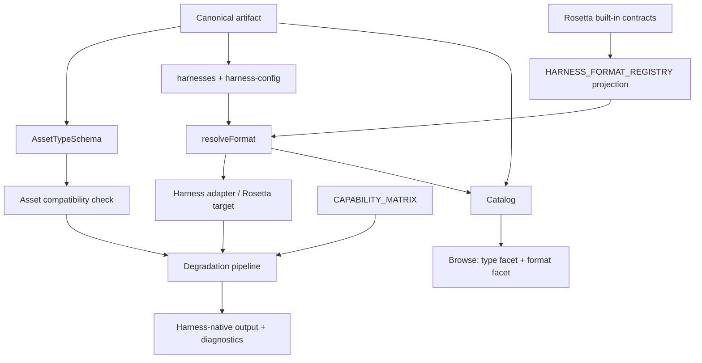
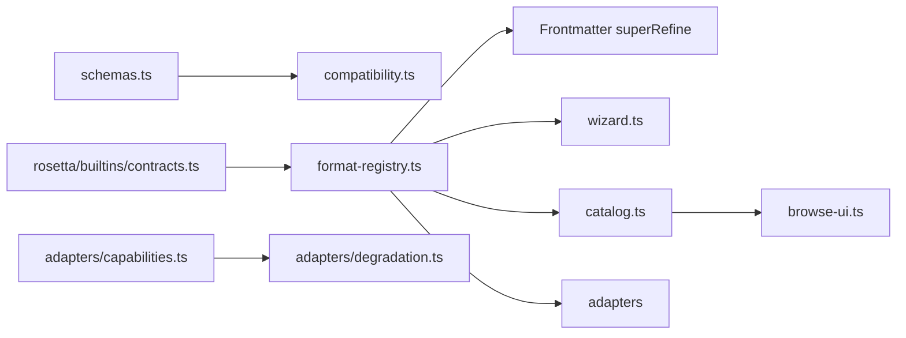

# Design Document: Per-Harness Artifact Type

## Contract

Apply the Kiro Spec Design contract (anchors: C4 Diagrams and ADRs): show structure at the appropriate C4 level and record significant decisions with context, decision, and consequences.

## Overview

This refresh preserves the useful implementation from the original spec while correcting its conceptual model. Canonical `type` remains meaningful. Rosetta built-in contracts own native variants and defaults. The format registry is a compatibility projection. Asset compatibility and feature capabilities remain separate support planes.

The resulting model has four layers:

| Layer | Question | Authority |
|---|---|---|
| Canonical semantics | What is the artifact? | `AssetTypeSchema` and any future type-scoped profile |
| Build compatibility | Can this type produce meaningful output for this harness? | `ASSET_HARNESS_COMPATIBILITY` |
| Native representation | Which harness-native variant and path contract are used? | Rosetta built-in Format_Contracts via `HARNESS_FORMAT_REGISTRY` |
| Feature fidelity | Which hooks/MCP/workflows/agents/inclusion semantics survive, and how do unsupported features degrade? | `CAPABILITY_MATRIX` and degradation pipeline |

Distribution channel is a future fifth layer. Academic Research Skills demonstrates why it cannot be merged with Harness: plugin, copied skills, repository clone, and wrapper channels can expose different controls for the same content and runtime.

## Current Format Matrix

The following values are a checked rendering of the Rosetta contract projection, not a second hand-authored authority.

| Harness | Variants | Default |
|---|---|---|
| `kiro` | `steering`, `power` | `steering` |
| `claude-code` | `claude-md` | `claude-md` |
| `codex` | `agents-md`, `skill` | `agents-md` |
| `copilot` | `instructions`, `agent` | `instructions` |
| `cursor` | `rule` | `rule` |
| `windsurf` | `rule` | `rule` |
| `cline` | `rule` | `rule` |
| `qdeveloper` | `rule`, `agent` | `rule` |
| `gemini-cli` | `gemini-md` | `gemini-md` |

Output paths, detection, security policy, and capability profiles remain in versioned Format_Contracts. Documentation should render those values rather than restating them manually.

## Architecture



### C4 Component View



## Components and Interfaces

### 1. Canonical Asset Type

`AssetTypeSchema` remains the structural authority:

```text
skill | power | rule | workflow | agent | prompt | template | reference-pack
```

`power` remains parseable only for backward compatibility. New artifacts use `type: skill` and Kiro `format: power` when that representation is desired.

A future subtype/profile follows the SciAgent lesson: it is semantic metadata constrained by canonical type, not a harness output choice. Mode-like variants follow the Academic Research Skills lesson: identity must be scoped, for example `(artifactId, modeName)`.

### 2. Rosetta Contract Projection

`HARNESS_FORMAT_REGISTRY` remains a lazy projection over non-source built-in contracts. The projection has one entry per supported harness.

```typescript
export interface HarnessFormatDefinition {
  readonly formats: readonly string[];
  readonly default: string;
}

export interface ResolveFormatResult {
  readonly format: string;
  readonly deprecationWarning?: string;
}
```

The public implementation may retain the established `HarnessFormatDef` name for compatibility. The key invariant is source ownership, not renaming.

Resolution precedence is:

1. Explicit `harness-config.<harness>.format`.
2. Legacy Kiro `power: true` when no explicit format exists.
3. Projected contract default.

### 3. Asset Compatibility

`ASSET_HARNESS_COMPATIBILITY` answers a coarse build question. Its three values are:

- `full`: native meaningful representation for the canonical type.
- `partial`: meaningful output with type-level fidelity loss.
- `none`: no meaningful output; strict policy rejects or skips.

The current default for omitted cells is `full`. Because this is permissive, parity and contradiction tests must make omissions intentional. A future implementation may prefer a fully materialized matrix, but that is an explicit migration rather than an incidental refactor.

### 4. Feature Capability and Degradation

`CAPABILITY_MATRIX` answers a narrower feature question over hooks, MCP, path scoping, workflows, toggleable rules, agents, file-match inclusion, and system-prompt merging. Non-full entries require `inline`, `comment`, or `omit` degradation.

Type-level and feature-level support may differ, but they must not overclaim. For example, a generic Markdown adapter can produce meaningful output for an agent artifact (`partial`) while lacking a declarative agent file surface (`none`, `omit`). That is a documented rationale, not a contradiction.

### 5. Schema Validation

`FrontmatterSchema.superRefine()` validates explicit format values against the projection while preserving harness-specific config. The refreshed design adds or confirms tests for unsupported harness keys and exact error contents.

The canonical-key inventory treats `harness-config` as recognized metadata even though it is implemented through passthrough plus refinement.

### 6. Wizard

The wizard sequence is:

1. Canonical name and identity metadata.
2. Canonical Asset_Type, excluding deprecated `power`.
3. Selected Harnesses from `SUPPORTED_HARNESSES`.
4. Format prompt for selected Harnesses where `formats.length > 1`.
5. Other canonical metadata.

Format labels explain representation. They do not imply that selecting `agent` changes canonical type to `agent`; incompatible combinations are handled by compatibility validation, not prompt-name coincidence.

### 7. Catalog and Browse

Catalog stores both semantic and representation facets:

```typescript
export interface FormatByHarness {
  readonly [harness: string]: string;
}
```

At runtime, keys are constrained to selected supported harnesses and values to resolved variants. A stronger schema may use a partial harness-keyed record if Zod v4 semantics are verified.

Browse UI presents:

- canonical `type` for semantic filtering;
- `harness:format` pairs for representation;
- compatibility/degradation details where available.

Neither type nor format replaces the other.

### 8. Distribution Channel Extension Point

No channel field is added now. A future channel model should use an interface equivalent to:

```typescript
export interface ChannelSupport {
  readonly harness: string;
  readonly channel: string;
  readonly delivery: "native" | "adapted" | "knowledge-only" | "unsupported";
  readonly mechanisms: Readonly<Record<string, "active" | "conditional" | "absent">>;
  readonly degradationReason?: string;
}
```

This captures the strongest Academic Research Skills lesson while avoiding premature schema growth.

## Data Models

### Canonical and representation records

| Model | Key | Value |
|---|---|---|
| Canonical semantics | Artifact | One `AssetType` plus canonical metadata |
| Asset compatibility | `(AssetType, HarnessName)` | `full | partial | none` |
| Format projection | `HarnessName` | Ordered variants plus one default |
| Feature capability | `(HarnessName, HarnessCapabilityName)` | Support plus required degradation when non-full |
| Catalog representation | Artifact and selected Harness | Resolved variant string |

These records are independent and joined by stable `HarnessName` and `AssetType` values. No record derives another record's support value implicitly.

## Correctness Properties

### Property 1: Harness parity

Every value in `SUPPORTED_HARNESSES` has exactly one adapter registration, one target/bidirectional built-in contract, one projected format entry, one capability row, and a defined compatibility policy.

**Validates: Requirements 8.1, 8.2, 8.3**

### Property 2: Variant parity

For each Harness, projected variants and default equal its Format_Contract variants and default.

**Validates: Requirements 2.1, 2.2, 2.3, 2.4**

### Property 3: Format independence

For any fixed Harness_Config, changing only Asset_Type does not change `resolveFormat()`.

**Validates: Requirements 1.5, 3.4**

### Property 4: Catalog resolution

For every catalog entry and selected Harness, `formatByHarness[harness]` equals `resolveFormat()`.

**Validates: Requirements 7.2, 7.3, 7.4**

### Property 5: Compatibility does not imply capability

Queries against compatibility and capability matrices return their own declared values; no layer upgrades another implicitly.

**Validates: Requirements 4.1, 4.2, 4.3, 4.4, 4.5**

### Property 6: Legacy precedence

Explicit Kiro format overrides `power: true`; the legacy flag applies only when explicit format is absent.

**Validates: Requirements 3.1, 3.2, 9.3, 9.4**

### Property 7: Round-trip preservation

Valid harness config, including unknown harness-specific extension keys, survives canonical parse/serialize equivalently.

**Validates: Requirements 5.3, 5.5, 9.5**

## Error Handling

| Condition | Severity | Behavior |
|---|---|---|
| Invalid explicit format | Error | Name harness, value, and projected valid variants |
| Missing target contract for supported harness | Error | Fail parity validation |
| Multiple target contracts for one harness | Error | Fail projection/parity validation |
| Missing capability row | Error | Fail matrix validation |
| Asset compatibility `none` | Warning or error | Follow normal versus strict build policy |
| Partial type/feature support | Warning | Surface declared degradation |
| `type: power` | Warning | Recommend `type: skill` plus Kiro power format |
| Legacy Kiro `power: true` | Warning | Preserve output; recommend explicit format |
| Old catalog lacks formats | None | Browse falls back without crashing |

## Testing Strategy

Use Bun tests around each authority boundary rather than duplicating every full matrix in test fixtures:

- Contract-to-format projection and one-contract-per-harness parity.
- Supported-harness parity across adapters, formats, capabilities, and compatibility policy.
- Format precedence and all nine defaults.
- Type/format independence across every Asset_Type and Harness.
- Explicit compatibility-versus-capability examples, including documented partial generic output.
- Schema diagnostics and passthrough round trips.
- Wizard prompts for Kiro, Codex, Copilot, and Q Developer only when multi-variant.
- Catalog `formatByHarness` key/value parity.
- Browse preservation of both type and format facets.

Property-based testing is useful for type/format independence and valid harness-config round trips but is optional for the MVP.

## Decision Record Delta

The implementation should update or add an ADR stating:

- Canonical Asset_Type remains first-class; only `power` is deprecated.
- Rosetta contracts own format variants/defaults.
- Asset compatibility, format selection, and feature capability are independent.
- Distribution channel remains a separate future concept.
- The older static seven-harness matrix and type-deprecation decision are superseded.
